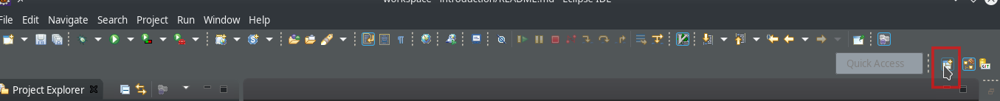
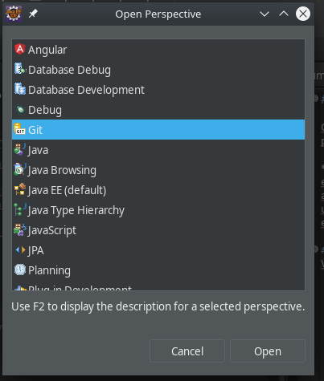
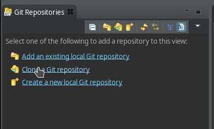
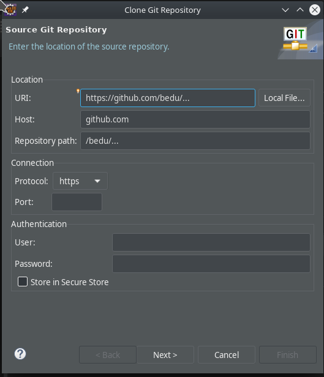
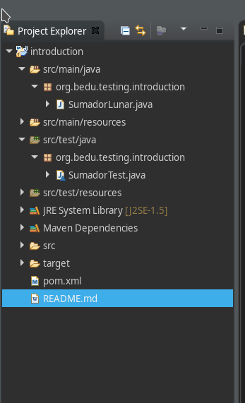
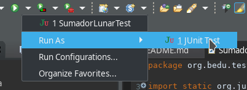
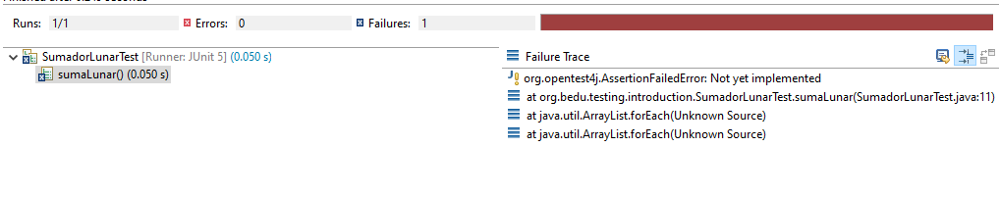

## Instalación del ambiente de pruebas

### OBJETIVO

- Instalar y verificar la instalación de un ambiente de pruebas para aplicaciones Java

#### REQUISITOS

1. JDK 11
2. IDE Eclipse

#### DESARROLLO

1. Ve a la perspectiva de Git

2. Selecciona Clonar un repositorio Git (Fig. 03)

3. Ingresa los datos del repositorio (Fig. 04)

4. Valida que la estructura del proyecto sea igual a la siguiente: 

5. Abre el archivo pom.xml y verifica que se agregan las dependencias de JUnit5 (junit jupiter) como framework de pruebas y que se configura el plugin de surefire para ejecutar las pruebas.

6. Abre la clase SumadorLunarTest, ve al botón RunAs -> JUnit Test

7. Verifica el resultado de la prueba, el cual debe ser una línea roja

