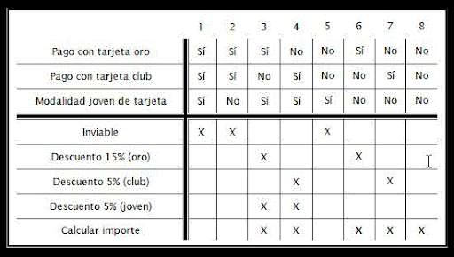
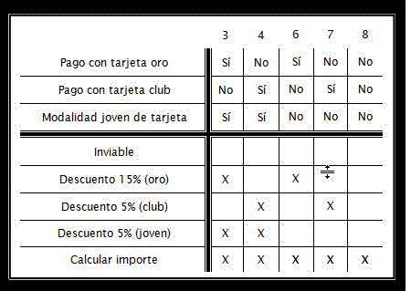

## Creación de tabla de decisión 

### OBJETIVO

- Definir casos de prueba útiles y que generan valor aplicando el método de la tabla de decisión.

#### DESARROLLO

1. Leer la especificación de los requisitos para aplicar descuento al pagar con tarjeta:

        Se quiere determinar el importe a facturar a los clientes de unos grandes almacenes según estos criterios:
        -Si pagan con tarjeta oro tendrán un 15% de descuento.
        -Si pagan con tarjeta club tendrán un 5% de descuento.
        -Si la tarjeta (oro o club) es modalidad joven, tendrán un 5% de descuento.
        -Los descuentos son acumulables.

2. Construir la tabla de decisión asociada a este planteamiento

3. Simplificar la tabla anterior, eliminando los casos inviables

