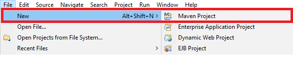

## Validando suposiciones con JUnit

### OBJETIVO

- Aprender las validaciones básicas de JUnit para comprobar la salida de una aplicación

#### REQUISITOS

1. JDK 11
2. Maven
3. Acceso a Internet, para descargar las dependencias necesarias de JUnit
4. IDE Eclipse

#### DESARROLLO

1. Crea un nuevo proyecto en Eclipse seleccionando la opción New -> Maven Project. Usaremos Maven para gestionar las dependencias del proyecto y así ahorrarnos tiempo en descargar y agregar las librerias correspondientes al proyecto.




2. Modifica el archivo pom.xml del proyecto para agregar las dependencias de JUnit:
```xml
	<dependencies>
		<dependency>
			<groupId>org.junit.jupiter</groupId>
			<artifactId>junit-jupiter-api</artifactId>
			<version>5.5.2</version>
			<scope>test</scope>
		</dependency>
		<dependency>
			<groupId>org.junit.jupiter</groupId>
			<artifactId>junit-jupiter-engine</artifactId>
			<version>5.5.2</version>
		</dependency>
	</dependencies>
```
3. Modifica el archivo pom.xml del proyecto para agregar la siguiente información de construcción del proyecto:
```xml
	<build>
		<plugins>
			<plugin>
				<groupId>org.apache.maven.plugins</groupId>
				<artifactId>maven-surefire-plugin</artifactId>
				<version>2.22.2</version>
			</plugin>
		</plugins>
	</build>
```

4. Crea una clase llamada Sumador que contenga el siguiente método sumaEnteros:

```java
public class Sumador {
	public int sumaEnteros(int a, int b) {
		return a + b;
	}
}
```

5. Crea una clase de pruebas (en el directorio src/test/java del proyecto) llamada SumadorTest, de la siguiente forma:
```java
public class SumadorTest {

}
```

6. Dentro de la clase, agrega un método de prueba en la que validaremos que la salida esperada sea correcta. Pon antención en la anotación @Test que está decorando el método.
```java
@Test
void sumaCorrecta(){
	Sumador sumador = new Sumador();
	int resutado = sumador.sumaEnteros(5, 2);
}
```

7. Para validar el funcionamiento del método sumador, verificaremos que la salida obtenida sea igual a la salida esperada usando el método assertEquals:
```java
	@Test
	void sumaCorrecta(){
		Sumador sumador = new Sumador();
		int resutado = sumador.sumaEnteros(5, 2);
		
		assertEquals(7, resutado, "El resultado debe ser igual a 7");
	}
```

8. Ejecutar el método anterior, con lo que debemos ver como resultado que la prueba ha sido exitosa.


