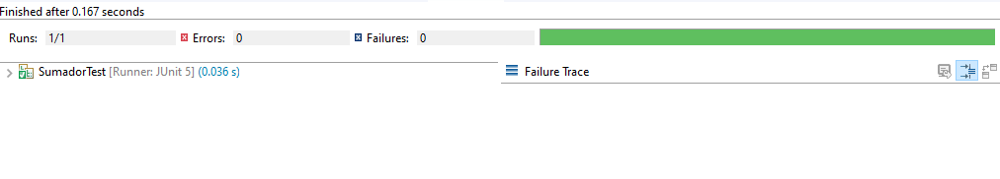

## Ejemplo 03: Validando suposiciones con JUnit

### OBJETIVO

- Aprender las validaciones básicas de JUnit para comprobar la salida de una aplicación

#### REQUISITOS

 - JDK 8 o superior
 - IDE de tu preferencia
 - Apache Maven
 - JUnit 5

#### DESARROLLO

1. Crea un nuevo proyecto en Eclipse seleccionando la opción New -> Maven Project. Usaremos Maven para gestionar las dependencias del proyecto y así ahorrarnos tiempo en descargar y agregar las librerias correspondientes al proyecto.


2. Modifica el archivo pom.xml del proyecto para agregar las dependencias de JUnit:
```xml
	<dependencies>
		<dependency>
			<groupId>org.junit.jupiter</groupId>
			<artifactId>junit-jupiter-api</artifactId>
			<version>5.5.2</version>
			<scope>test</scope>
		</dependency>
		<dependency>
			<groupId>org.junit.jupiter</groupId>
			<artifactId>junit-jupiter-engine</artifactId>
			<version>5.5.2</version>
		</dependency>
	</dependencies>
```
3. Modifica el archivo pom.xml del proyecto para agregar la siguiente información de construcción del proyecto, con la que agregamos el plugin de surfire que nos ayuda a la ejeccución de las pruebas unitarias en proyectos Maven:
```xml
	<build>
		<plugins>
			<plugin>
				<groupId>org.apache.maven.plugins</groupId>
				<artifactId>maven-surefire-plugin</artifactId>
				<version>2.22.2</version>
			</plugin>
		</plugins>
	</build>
```

4. Crea una clase llamada Sumador que contenga el siguiente método sumaEnteros. Este es un método muy simple porque queremos enfocarnos en el uso de JUnit y no en la complejidad del método que probaremos:

```java
public class Sumador {
	public int sumaEnteros(int a, int b) {
		return a + b;
	}
}
```

5. Crea una clase de pruebas (en el directorio src/test/java del proyecto) llamada SumadorTest, de la siguiente forma:
```java
public class SumadorTest {

}
```

Por convención, las clases de pruebas unitarias tienen el mismo nombre que la clase que probarán, agregando el posfijo Test.

6. Dentro de la clase, agrega un método de prueba en la que validaremos que la salida esperada sea correcta. Pon antención en la anotación @Test que está decorando el método, esta anotación de JUnit indica que ese método contiene una prueba que el motor de JUnt debe ejecutar.
```java
@Test
void sumaCorrecta(){
	Sumador sumador = new Sumador();
	int resutado = sumador.sumaEnteros(5, 2);
}
```

7. Para comprobar que el método sumador está funcionando correctamente, verifica que la salida real sea igual a la salida esperada usando el método assertEquals. 

Los métodos assert sirven para comprobar valores que sabemos que nuestro método debe arrojar. Existen variaciones de este método para prácticamente todos los tipos de datos primitivos de Java, arreglos, objetos y algunas colecciones. En gneeral estos métodos reciben como primer parámetro el valor esperado, este es el valor que sabemos que la funcionalidad que estamos probando debe arrojar; como segundo parámetro reciben el valor real que arroja la aplicación (y que esperamos sea igual al valor esperado), este valor se obtiene directamente del llamado al método que estamos probando; finalmente, hay un tercer parámetro opcional en el que podemos colocar un mensaje que se mostrará sólo en el caso que la ejecución sea incorrecta, esto es: que el valor esperado y el real no sean iguales.	
```java
	@Test
	void sumaCorrecta(){
		Sumador sumador = new Sumador();
		int resutado = sumador.sumaEnteros(5, 2);
		
		assertEquals(7, resutado, "El resultado debe ser igual a 7");
	}
```

8. Ejecuta el método anterior, con lo que debemos ver como resultado que la prueba ha sido exitosa.


