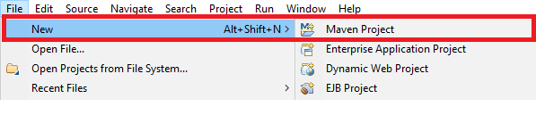
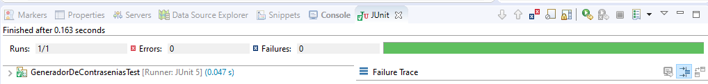

## Testing aplicado a tu proyecto

### OBJETIVO

- Reforzar el aprendizaje de la sesión 1.
- Tener un proyecto configurado con los elementos necesarios para inicializar con pruebas unitarias, las cuales irás mejorando a lo largo de las sesiones.
- Contar con un proyecto Maven y un archivo **pom.xml** modificado para que se puedan ejecutar pruebas unitarias.

#### REQUISITOS

1. Contar con el JDK 8 o superior instalado.
2. Contar con Apache Maven instalado.


#### DESARROLLO

1. Crea un nuevo proyecto en Eclipse seleccionando la opción **New -> Maven Project**. Usa Maven para gestionar las dependencias del proyecto y así ahorrar tiempo en descargar y agregar las librerias correspondientes al proyecto.




_Nota_: Es necesario tener conexión a Internet la primera vez que se compile, pruebe y ejecute el proyecto, ya que este descargará las dependencias necesarias para llevar a cabo estos de forma correcta.


2. Modifica el archivo **pom.xml** del proyecto para agregar las dependencias de JUnit 5; esto permitirá que este sea el framework de pruebas usado en el proyecto:

```xml
	<dependencies>
		<dependency>
			<groupId>org.junit.jupiter</groupId>
			<artifactId>junit-jupiter-api</artifactId>
			<version>5.5.2</version>
			<scope>test</scope>
		</dependency>
		<dependency>
			<groupId>org.junit.jupiter</groupId>
			<artifactId>junit-jupiter-engine</artifactId>
			<version>5.5.2</version>
		</dependency>
	</dependencies>
```

3. Modifica nuevamente el archivo **pom.xml** del proyecto para agregar la siguiente información de construcción, el plugin de surfire que ayuda a la ejeccución de las pruebas unitarias en proyectos Maven:

```xml
	<build>
		<plugins>
			<plugin>
				<groupId>org.apache.maven.plugins</groupId>
				<artifactId>maven-surefire-plugin</artifactId>
				<version>2.22.2</version>
			</plugin>
		</plugins>
	</build>
```

4. Crea una clase llamada **GeneradorDeContrasenias** que tenga el siguiente contenido:

```java
public class GeneradorDeContrasenias {

    private List<String> contrasenias = new ArrayList<String>();
    private Set<String> contras = new HashSet<String>();
    private int totalContrasenias;

    public GeneradorDeContrasenias() {
        totalContrasenias = 1;
    }

    public GeneradorDeContrasenias(int totalContrasenias) {
        this.totalContrasenias = totalContrasenias;
    }

    public int getTotalContrasenias() {
        return totalContrasenias;
    }

    public List<String> getContrasenas() {
        return contrasenias;
    }

    //genera las contraseñas con un tamaño definido(64) resultado de aplicar SHA-256
    public void generaTodasLasContrasenias() throws NoSuchAlgorithmException {
        int i = 0;
        Date fecha = new Date();
        while (contras.size() < totalContrasenias) {
            contras.add(generaPassword(String.valueOf(fecha.getTime()) + i++));
        }
        for (String contraActual : contras) {
            contrasenias.add(contraActual);
        }
    }

    //Genera las contraseñas con un tamaño especificado
    public void generaTodasLasContrasenias(int tamanio) throws NoSuchAlgorithmException {
        generaTodasLasContrasenias();
        if (tamanio > 64 || tamanio < 1) {
            throw new IllegalArgumentException("El tamaño de contraseña requerido está fuera del rango permitido (1-64)");
        }
        for (int i = 0; i < contrasenias.size(); i++) {
            contrasenias.set(i, contrasenias.get(i).substring(0, tamanio));
        }

    }

    //aplicación del SHA para generar la contraseña a partir de una cadena
    private String generaPassword(String password) throws NoSuchAlgorithmException {
        MessageDigest md = MessageDigest.getInstance("SHA-256");
        md.update(password.getBytes());
        byte byteData[] = md.digest();
        StringBuilder sb = new StringBuilder();
        for (int i = 0; i < byteData.length; i++) {
            sb.append(Integer.toString((byteData[i] & 0xff) + 0x100, 16).substring(1));
        }
        return sb.toString();
    }
}
```

5. Crea una clase de pruebas (en el directorio **src/test/java** del proyecto) llamada GeneradorDeContraseniasTest, de la siguiente forma:
```java
public class GeneradorDeContraseniasTest {

}
```

6. Dentro de la clase, agrega un método de prueba en la que validaremos que la salida esperada sea correcta. Pon antención en la anotación @Test que está decorando el método, esta anotación de JUnit indica que ese método contiene una prueba que el motor de JUnt debe ejecutar.
```java

   private static GeneradorDeContrasenias generador;

    @BeforeEach
    public static void inicializa() throws NoSuchAlgorithmException
    {
        generador = new GeneradorDeContrasenias(10);
        generador.generaTodasLasContrasenias(12);
    }

```

7. Para comprobar que el método sumador está funcionando correctamente, verifica que la salida real sea igual a la salida esperada usando el método assertNotNull. 

```java
    @Test
    public void pruebaGeneradorNoDevuelveListaNulaDeElementos() {
        assertNotNull(generador.getContrasenas());
    }
```

8. Ejecuta el método anterior, con lo que debemos ver como resultado que la prueba ha sido exitosa.


