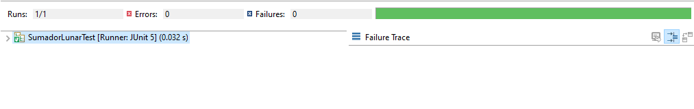
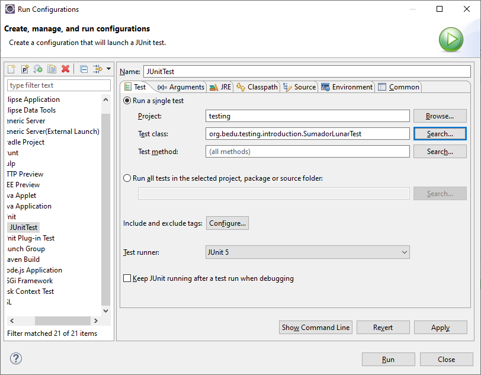
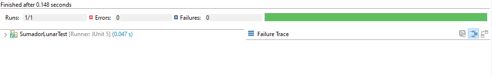

## Reto 01: Ejecutando una prueba exitosa

### OBJETIVO 

- Realizar las modificaciones necesarias en el código del ejemplo anterior, para que la prueba se ejecute de forma exitosa, haciendo uso de las clases SumadorLunar y SumadorLunarTest.

#### REQUISITOS 

 - JDK 8 o superior
 - IDE de tu preferencia
 - Apache Maven
 - JUnit 5
 - Ejemplo 01 (Sumador Lunar)

#### DESARROLLO

Modifica la clase SumadorLunarTest de forma que la prueba deje de fallar, obteniendo una salida como la siguiente:




<details>
<summary>Solucion</summary>
1. Modifica la clase SumadorLunarTest eliminando la línea siguiente línea, la cual es una instrucción que indica a JUnit (el framework de pruebas unitarias que estamos usando para el ejemplo) que cuando llegue a esa instrucción la prueba debe fallar. Esto normalmente se usa cuando tenemos una situación en la que, por ejemplo, se lanza una excepción y por lo tanto la siguiente línea después del código que lanzó la excepción nunca se debe ejecutar:

	fail("Not yet implemented");

2. Crea una nueva instanacia de la clase SumadorLunar dentro del método sumaLunar:

```java
	void sumaLunar() {
		SumadorLunar sumador = new SumadorLunar();
	}
```
3. Invoca el método suma de la instancia sumador, pasando cualquier par de números enteros como parámetros
```java
	sumador.sumar(12, 25);
```

4. Abre la clase SumadorLunarTest, ve al botón RunAs -> JUnit Test. Si es la primera vez que ejecutas el código, tal vez te pida realizar una configuración inicial para indicar qué clase de prueba es la que estas tratando de ejecutar. En la opción de Run Configurations selecciona, en la primera opción, el proyecto actual, y como clase de prueba selecciona SumadorLunarTest:



5. Ejecuta la prueba, y si todo está bien configurado se debe ver una salida como la siguiente, la cual significa que no se detectaron errores durante la ejecución de la prueba:



Esta primera prueba ha sido muy sencilla, ya que no valida nada de lógica de la aplicación. En las siguientes unidades aprendarás cómo hacer estas validaciones, las cuales agregan mucho valor a tu desarrollo.

</details> 
