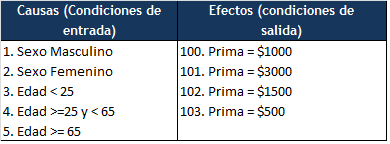
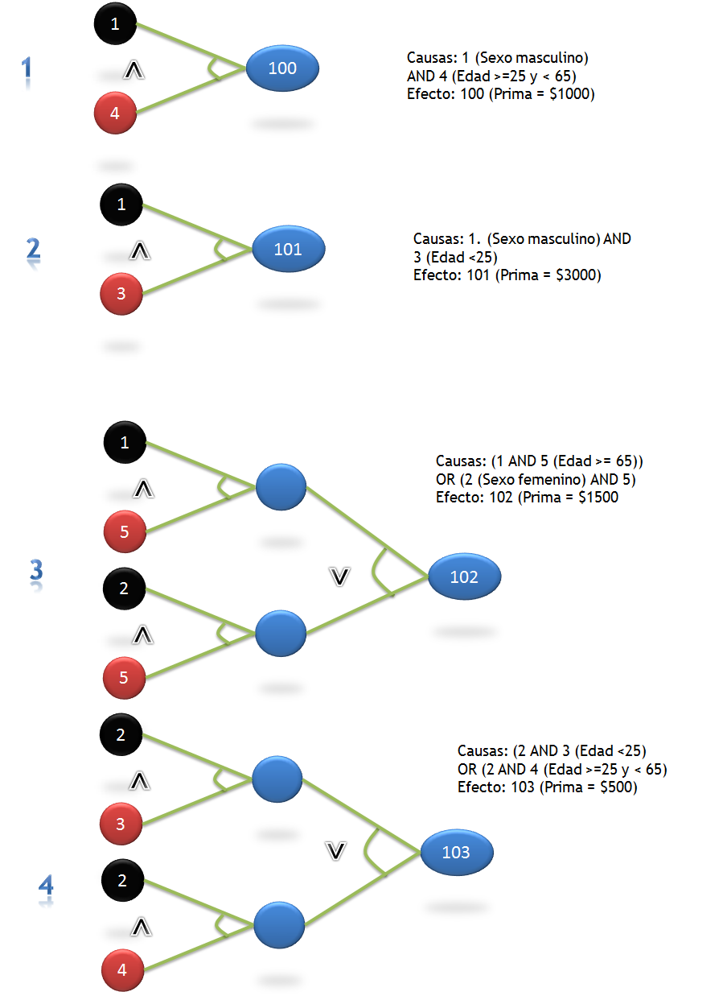
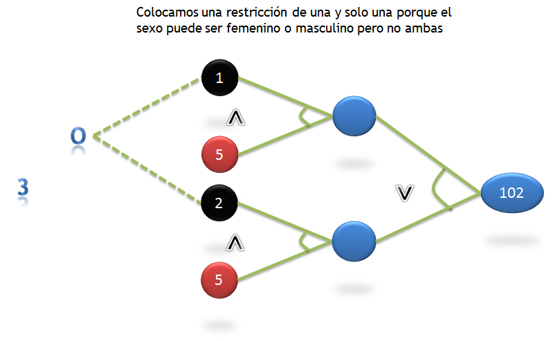
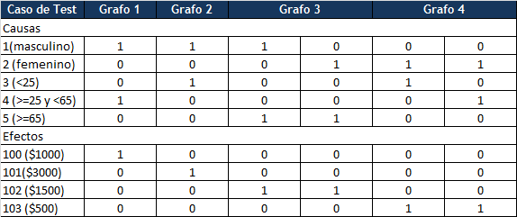
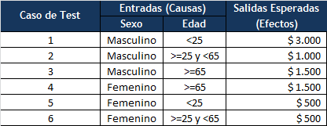

## Uso de los métodos gráfos Causa-Efecto y tablas de decisión para casos de prueba

### OBJETIVO 

- Aplicar dos métodos combinados para diseñar casos de prueba.

#### DESARROLLO

1.Revisar los requerimientos para calcular primas en seguros de autos, mostrados a continuación:

    - Para mujeres de menos de 65 años, la prima es de $500
    - Para hombres de menos de 25 años, la prima es de $3000
    - Para hombres entre 25 y 64 años, la prima es de $1000
    - Para cualquiera de mas de 65 años, la prima es de $1500

Solucion

2. Identificar Causas y efectos

3. Elaboramos grafos

4. Colocamos una restricción de una y solo una porque el sexo puede ser masculino o femenino pero no ambos

5. Elaboramos la tabla de decisión

6. Elaboramos los casos de prueba

 

