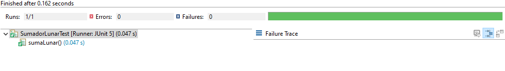

## Validación de suposiciones usando JUnit

### OBJETIVO 

- Validar la salida de la ejecución del método sumar de la clase SumadorLunar que se hizo en el Ejemplo-01

#### DESARROLLO

Realiza la implementación del método "suma" de la clase "SumadorLunar" visto en el Ejemplo-01; recuerda que el sumador lunar, la suma de dos digitos siempre da como resultado el digito más grande, por ejemplo: 

	 12
	+25
 	----
	 25
	 
	 13 
	+ 6 
	---
	 16

	  169
	+ 248
	------
	  269

Para simplificar la programación, asumiremos que los dos números de entrada siepre tienen la misma longitud.

Como segundo paso, crea un par de pruebas unitarias que permitan comprobar la salida de la aplicación.

<details>

<summary>Solucion</summary>
1. Implementar el método suma. Se propone la siguiente implementación pero no es la única que proporciona el resultado correcto:
```java
public class SumadorLunar {

	public Integer sumar(Integer a, Integer b) {
		
		String strA = codificaNumero(a);
		String strB = codificaNumero(b);
		
		StringBuilder resultado = new StringBuilder();
		
		for(int i = 0; i < strA.length(); i++) {
			resultado.append(getDigitoMayor(strA.charAt(i), strB.charAt(i)));
		}
		
		return Integer.parseInt(resultado.toString());
	}
	
	private String codificaNumero(Integer numero) {
		return String.valueOf(numero);
	}
	
	private String getDigitoMayor(char a, char b) {
		return String.valueOf(Math.max(Character.getNumericValue(a), Character.getNumericValue(b)));
	}
}
```


2. Implementamos la clase de prueba, usando el método assertEquals:
```java
	@Test
	void sumaLunar() {
		SumadorLunar sumador = new SumadorLunar();
		assertEquals(25, sumador.sumar(12, 25));
		assertEquals(269, sumador.sumar(169, 248));
	}
```

3. Ejecutamos la prueba y comprobamos que el resultado de todas las pruebas sea correcto.




</details> 


