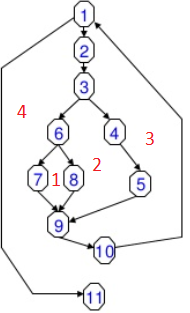

## Ejemplo 01: Complejidad Ciclomática

### OBJETIVO

- Aprender a calcular la complejidad ciclomática de un bloque de código.

#### DESARROLLO

1. Dibuja el gráfico de flujo del siguiente bloque de pseudo-código, el número a la izquierda de la instucción representa esa instrucción en el grafo. Recuerda que dentro del grafo las instrucciones son representadas por nodos y el flujo de la aplicación es representado por las aristas o líneas que conectan estos nodos:

		1) WHILE NOT final DO
			2) leer
			3) IF campo 1=0 THEN
				4) procesar()
				5) incrementar_contador()
			6) ELSE IF campo 1=1 THEN
				7) reinicia_contador()
			8) ELSE
				9) procesar()
			10) END IF
		11) END WHILE

Existen muchas técnicas para generar el grafo, por lo que no te preocupes si el tuyo no queda exactamente como el siguiente; a lo largo de los ejemplos usaremos distintas técnicas para representar y generar los grafos.

2. Calcula la complejidad ciclomática usando el método del número de regiones. Para ver claramente cada región puedes poner cada una de un color diferente o etiquetar la región con un número o letra.

En el ejemplo anterior tenemos que existen cuatro regiones cerradas dentro de la imagen; por lo tanto la complejidad ciclomática del bloque de pseudo código anterior es 4.

3. Comprueba que el valor anterior usando el número de nodos y aristas. A modo de recordatorio, la fórmula es la siguiente:

		V(G) = E - N + 2, donde
		E = Número de Aristas
		N = Número de nodos.

Tip: Algunas veces dependiendo del método que utilices para calcularlo, el valor de la complejidad puede variar; lo normal es tener una diferencia de uno, ya sea positivo o negativo. Si el valor tiene una variación mayor es posible que haya algo equivocado en el cálculo o que el grafo esté mal dibujado. 

Del grafo anterior tenemos que:
		E = 13
		N = 11
	
Por lo tanto:

		V(G) = 13 - 11 + 2
		V(G) = 2 + 2
		V(G) = 4
		
Con estos cálculos puedes comprobar que la complejidad ciclomática es 4.

4. Corrobora los cálculos anteriores usando el método de los nodos predicado. Recuerda que los nodo predicado son aquellos nodos de condición, o los nodos de los que se despreden otros dos o más nodos.

La fórmula para el cálculo de la complejidad ciclomática usando los nodos pedicado es:

		V(G) = P + 1, donde
		P = Número de nodos predicado
		
En el grafo puedes ver que existen 3 nodos predicado: los nodos 1, 3 y 6. Por lo tanto:

		V(G) = 3 + 1
		V(G) = 4
		
Con esto puedes comprobar que la complejidad ciclomática es 4.
