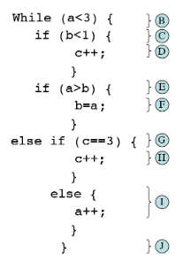
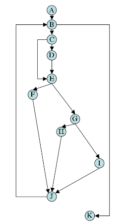

## Complejidad Ciclomática en código

### OBJETIVO

- Calcular la complejidad ciclomática de un bloque de código.

#### DESARROLLO

1. Etiqueta cada uno de los bloques del siguiente código.

Tip: El código contiene además de instrucciones secuenciales (que se ejecutan siempre una después de la otra).

		while (a < 3){
			if (b < 1){
				c++;
			}
			if (a > b) {
				b = a;
			}
			else if (c == 3){
				c++;
			}
			else {
				a++;
			}
		}

1. Dibujar el gráfico de flujo del siguiente bloque de código:

2. Calcular la complejidad ciclomática usando el número de nodos y aristas. A modo de recordatorio, la formula es la siguiente:

		V(G) = E - N + 2, donde
		E = Número de Aristas
		N = Número de nodos.
		
Tenemos que:
		E = 14
		N = 11
	
Por lo tanto:

		V(G) = 14 - 11 + 2
		V(G) = 3 + 2
		V(G) = 5
		
En el ejemplo anterior podemos comprobar que la complejidad ciclomática es 5.

3. Corroborar el valor anteriores usando el método de los nodos predicado. Recuerda que los nodo predicado son aquellos nodos de condición, o los nodos de los que se despreden otros dos o más nodos.

La formula para el cálculo de la complejidad ciclomática usando los nodos pedicado es:

		V(G) = P + 1, donde
		P = Número de nodos predicado
		
En el grafo podemos ver que existen 4 nodos predicado: los nodos B, C, E y G. Por lo tanto

		V(G) = 4 + 1
		V(G) = 5
		
En el ejemplo anterior podemos comprobar que la complejidad complejidad ciclomática es 5.
