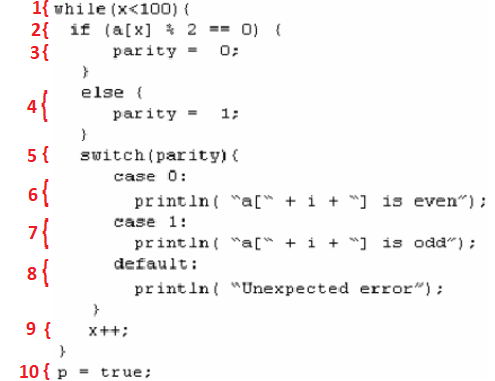
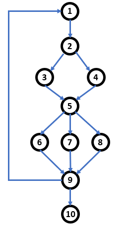

## Complejidad Ciclomática en código

### OBJETIVO

- Calcular la complejidad ciclomática de un bloque de código.

#### DESARROLLO

1. Etiqueta cada uno de los bloques del siguiente código.

Tip: El código contiene además de instrucciones secuenciales (que se ejecutan siempre una después de la otra).

	while (x < 100) {
  		if (a[x] % 2 == 0) {
    			paridad = 0;
  		}
  		else {
    			paridad = 1;
  		}
  
  		switch(paridad) {
    			case 0:
      				println("a[" + x + "] es par");
      				break;
    			case 1:
      				println("a[" + x + "] es impar");
      				break;
    			default:
      				println("Error inesperado");
       
  		}
  
  		x++;
	}

	p = true;

2. Dibujar el gráfico de flujo del siguiente bloque de código:

3. Calcular la complejidad ciclomática usando el número de nodos y aristas. A modo de recordatorio, la formula es la siguiente:

		V(G) = E - N + 2, donde
		E = Número de Aristas
		N = Número de nodos.
		
Tenemos que:
		E = 13
		N = 10
	
Por lo tanto:

		V(G) = 13 - 10 + 2
		V(G) = 3 + 2
		V(G) = 5	
		
En el ejemplo anterior podemos comprobar que la complejidad ciclomática es 5.

