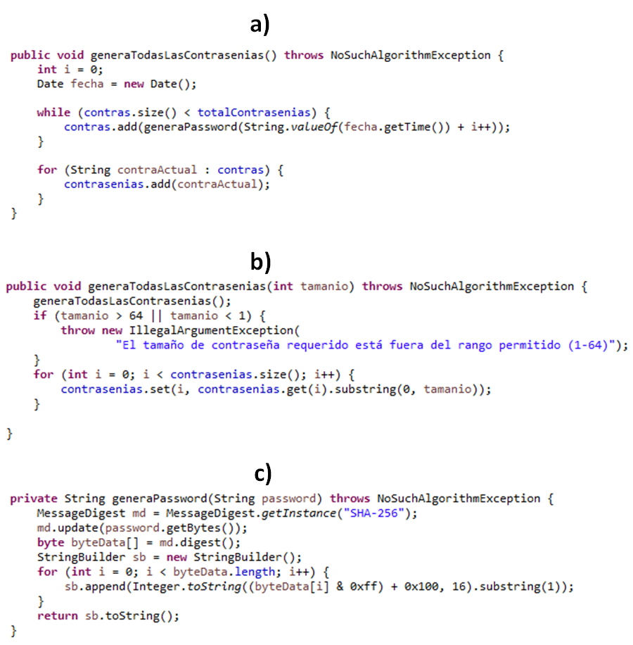
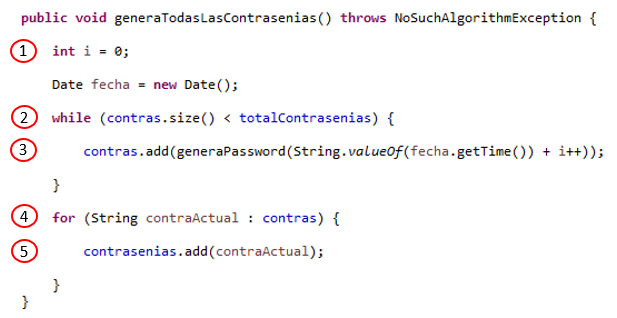
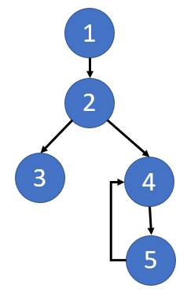
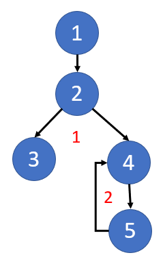
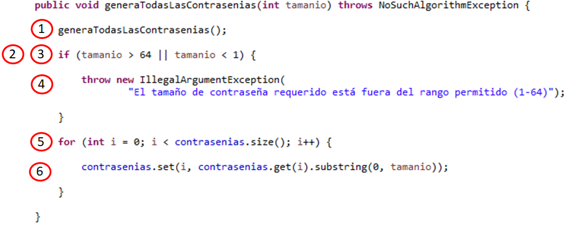
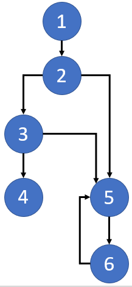
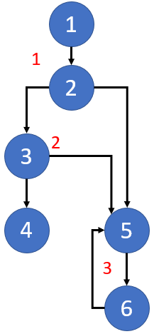
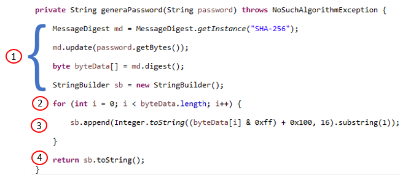
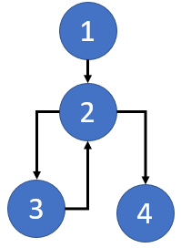
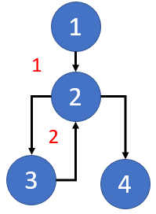

## Postwork 02: Complejidad Ciclomática aplicada a tu proyecto

### OBJETIVO

- Determinar el valor de la complejidad ciclomática del código de tu proyecto para conocer el número de caminos o flujos que será necesario probar durante la implementación de las pruebas unitarias.
- Calcular el valor de la complejidad ciclomática usando distintos métodos, lo cual nos ayudará a comprobar que el cálculo se hizo de manera correcta.

#### DESARROLLO

Calcularás la complejidad ciclomática de algunos de los bloques de código más importantes de tu proyecto.

1. Abre el archivo **GeneradorDeContrasenias** del proyecto que se encuentra en el repositorio y busca los dos metodos **generaTodasLasContrasenias** y **generaPassword**. En la imagen siguiente están marcados como los métodos **a**, **b** y **c**:

2. Etiqueta cada una de las instrucciones del bloque de código **a**.

Tip: El código contiene además de instrucciones secuenciales (que se ejecutan siempre una después de la otra, ¿cómo debes representar estas instrucciones?).

El código **a** etiquetado queda de la siguiente forma:

3. Dibuja el gráfico de flujo del código:

4. Obtén la complejidad ciclomática usando la técnica del número de regiones en el grafo:

5. Calcula la complejidad ciclomática usando el número de nodos y aristas. A modo de recordatorio, la fórmula es la siguiente:

		V(G) = E - N + 2, donde
		E = Número de Aristas
		N = Número de nodos.
		
Tenemos que:
		E = 5
		N = 5
	
Por lo tanto:

		V(G) = 5 - 5 + 2
		V(G) = 0 + 2
		V(G) = 2
		
En el ejemplo anterior podemos comprobar que la complejidad ciclomática es **2**.

6. Corrobora el valor anterior usando el método de los nodos predicado. Recuerda que los nodo predicado son aquellos nodos de condición, o los nodos de los que se desprenden otros dos o más nodos.

La fórmula para el cálculo de la complejidad ciclomática usando los nodos predicado es:

		V(G) = P + 1, donde
		P = Número de nodos predicado
		
En el grafo podemos ver que existen **1** nodo predicado: el nodo **2**:

		V(G) = 1 + 1
		V(G) = 2
		
Con esto, podemos comprobar que la complejidad ciclomática es **2**.

7. Etiqueta cada una de las instrucciones del bloque de código **b**.

El código **b** etiquetado queda de la  forma:

8. Dibuja el gráfico de flujo del código:

9. Obtén la complejidad ciclomática usando la técnica del número de regiones en el grafo:

10. Calcula la complejidad ciclomática usando el número de nodos y aristas. A modo de recordatorio, la fórmula es la siguiente:

		V(G) = E - N + 2, donde
		E = Número de Aristas
		N = Número de nodos.
		
Tenemos que:
		E = 7
		N = 6
	
Por lo tanto:

		V(G) = 7 - 6 + 2
		V(G) = 1 + 2
		V(G) = 3
		
En el ejemplo anterior podemos comprobar que la complejidad ciclomática es **3**.

11. Corrobora el valor anterior usando el método de los nodos predicado. Recuerda que los nodo predicado son aquellos nodos de condición, o los nodos de los que se desprenden otros dos o más nodos.

La fórmula para el cálculo de la complejidad ciclomática usando los nodos predicado es:

		V(G) = P + 1, donde
		P = Número de nodos predicado
		
En el grafo podemos ver que existen **2** nodos predicado: los nodos **2** y **3**:

		V(G) = 2 + 1
		V(G) = 3
		
Con esto, podemos comprobar que la complejidad ciclomática es **3**.

12. Etiqueta cada una de las instrucciones del bloque de código **c**.

El código **c** etiquetado queda de la siguiente forma:

13. Dibuja el gráfico de flujo del código:

14. Obtén la complejidad ciclomática usando la técnica del número de regiones en el grafo:

15. Calcula la complejidad ciclomática usando el número de nodos y aristas. A modo de recordatorio, la fórmula es la siguiente:

		V(G) = E - N + 2, donde
		E = Número de Aristas
		N = Número de nodos.
		
Tenemos que:
		E = 4
		N = 4

Por lo tanto:

		V(G) = 4 - 4 + 2
		V(G) = 0 + 2
		V(G) = 2
		
En el ejemplo anterior podemos comprobar que la complejidad ciclomática es **2**.

16. Corrobora el valor anterior usando el método de los nodos predicado. Recuerda que los nodo predicado son aquellos nodos de condición, o los nodos de los que se desprenden otros dos o más nodos.

La fórmula para el cálculo de la complejidad ciclomática usando los nodos predicado es:

		V(G) = P + 1, donde
		P = Número de nodos predicado
		
En el grafo podemos ver que existen **1** nodo predicado: el nodo **2**:

		V(G) = 1 + 1
		V(G) = 2
		
Con esto, podemos comprobar que la complejidad ciclomática es **2**.
