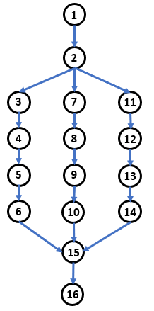
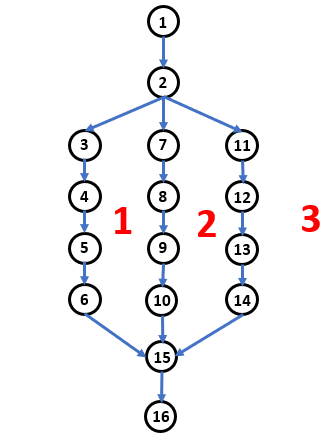

## Complejidad Ciclomática

### OBJETIVO

- Calcular la complejidad ciclomática de un bloque de código.

#### DESARROLLO

1. Dibujar el gráfico de flujo del siguiente bloque de pseudo-código, el número a la izquierda de la instucción representa esa instrucción en el grafo:

		1) seleccionar_idioma()
  			2) SWITCH 
    				3) CASE idioma = español THEN
        				4) cargar_interfaz_español()
        				5) cargar_diccionario_español()
        				6) cargar_tutorial_español()
    				7) CASE idioma = inglés THEN
        				8)  cargar_interfaz_inglés()
        				9) cargar_diccionario_inglés()
        				10) cargar_tutorial_inglés()
    				11) CASE idioma = alemán THEN
        				12)  cargar_interfaz_alemán()
        				13) cargar_diccionario_alemán()
        				14) cargar_tutorial_alemán()
  			15) END_SWITCH
  		16) iniciar_aplicación()

	
Solucion

2. Calcular la complejidad ciclomática usando el método del número de regiones. Para ver claramente cada región un número en cada una de ellas.

En el ejemplo anterior, la complejidad ciclomática es 3.

3. Corroborar el valor anterior usando el número de nodos y aristas. A modo de recordatorio, la formula es la siguiente:

		V(G) = E - N + 2, donde
		E = Número de Aristas
		N = Número de nodos.
		
Tenemos que:
		E = 17
		N = 16
	
Por lo tanto:

		V(G) = 17 - 16 + 2
		V(G) = 1 + 2
		V(G) = 3
		
En el ejemplo anterior podemos comprobar que la complejidad ciclomática es 3.
		

