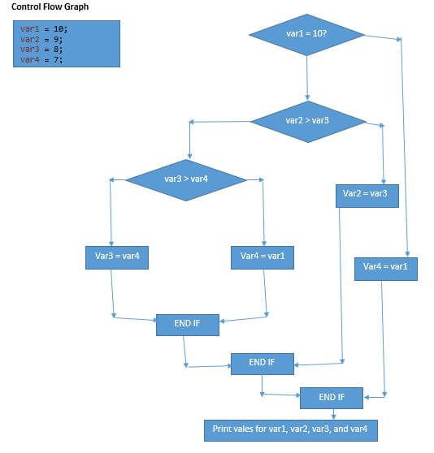

## Reto 02: Complejidad Ciclomática en código

### OBJETIVO

- Calcular la complejidad ciclomática de un bloque de código Java.

#### DESARROLLO

Calcula la complejidad ciclomática el siguiente bloque de código:

```java
	package com.stc.cc;

	public class CyclomaticComplexityDemo {

  		public static void main(String[] args) {       
             
			int var1 = 10;
			int var2 = 9;
			int var3 = 8;
			int var4 = 7;
          
			if (var1 == 10) {
				if(var2 > var3) {
					var2 = var3;
				}
				else {
					if (var3 > var4) {
						var3 = var4;
					}
					else{
						var4 = var1;
					}
				}
			}
			else {
				var1=var4;
			}

			System.out.println("Printing value for var1, var2, var3, and var4"+var1+" "+var2+" "+var3+" "+var4); 

		}	
	}
```


<details>
	<summary>Solución</summary>


1. Dibuja el gráfico de flujo:




2. Calcula la complejidad ciclomática usando el número de nodos y aristas. A modo de recordatorio, la fórmula es la siguiente:

		V(G) = E - N + 2, donde
		E = Número de Aristas
		N = Número de nodos.
		
Tenemos que:
		E = 13
		N = 11
	
Por lo tanto:

		V(G) = 13 - 11 + 2
		V(G) = 2 + 2
		V(G) = 4
		
En el ejemplo anterior podemos comprobar que la complejidad ciclomática es 4.

3. Corrobora el valor anterior usando el método de los nodos predicado. Recuerda que los nodo predicado son aquellos nodos de condición, o los nodos de los que se despreden otros dos o más nodos.

La fórmula para el cálculo de la complejidad ciclomática usando los nodos pedicado es:

		V(G) = P + 1, donde
		P = Número de nodos predicado
		
En el grafo podemos ver que existen 3 nodos predicado:

		V(G) = 3 + 1
		V(G) = 4
		
En el ejemplo anterior podemos comprobar que la complejidad ciclomática es 4.

</details> 
