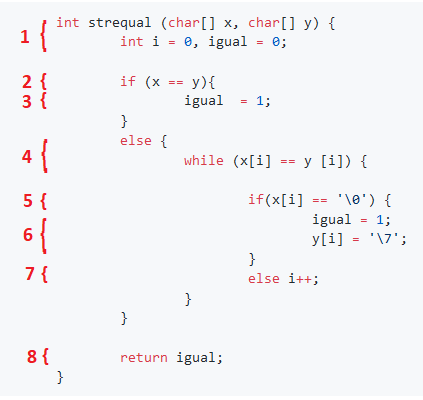
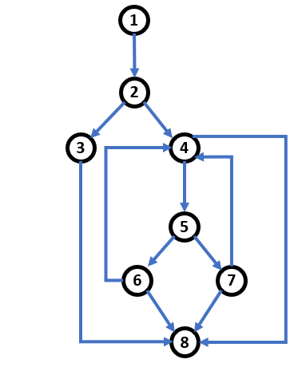

## Reto 03: Complejidad Ciclomática en código

### OBJETIVO

- Calcular la complejidad ciclomática de un bloque de código.

#### DESARROLLO

Calcula la complejidad ciclomática del siguiente bloque de código:

```java
	int strequal (char[] x, char[] y)
	{ int i = 0, igual = 0;
  		if (x == y)
      			igual  = 1;
  		else while (x[i] == y [i])
       		     {  if(x[i] == '\0')
          		{
            			igual = 1;
            			y[i] = '\7';
          		}
          		else i++;
       		}
       
    	return igual;
	}
```

<details>
	<summary>Solución</summary>

1. Acomoda el código del ejemplo, de esta forma será mucho más fácil etiquetarlo y crear el grafo de flujo.

```java
	int strequal (char[] x, char[] y) { 
		int i = 0, igual = 0;
  		
		if (x == y){
      			igual  = 1;
		}
  		else {
			while (x[i] == y [i]) {  
				
				if(x[i] == '\0') {
            				igual = 1;
            				y[i] = '\7';
          			}
          			else i++;
       			}
       		}
    		
		return igual;
	}
```

2. Etiqueta cada una de las instrucciones de la aplicación.




3. Dibuja el gráfico de flujo:




4. Calcula la complejidad ciclomática usando el número de nodos y aristas. A modo de recordatorio, la fórmula es la siguiente:

		V(G) = E - N + 2, donde
		E = Número de Aristas
		N = Número de nodos.
		
Tenemos que:
		E = 12
		N = 8
	
Por lo tanto:

		V(G) = 12 - 8 + 2
		V(G) = 4 + 2
		V(G) = 6
		
En el ejemplo anterior podemos comprobar que la complejidad ciclomática es 6.

5. Corrobora el valor anteriores usando el método de los nodos predicado. Recuerda que los nodo predicado son aquellos nodos de condición, o los nodos de los que se despreden otros dos o más nodos.

La fórmula para el cálculo de la complejidad ciclomática usando los nodos pedicado es:

		V(G) = P + 1, donde
		P = Número de nodos predicado
		
En el grafo podemos ver que existen 5 nodos predicado:

		V(G) = 5 + 1
		V(G) = 6
		
En el ejemplo anterior podemos comprobar que la complejidad complejidad ciclomática es 6.

</details> 
