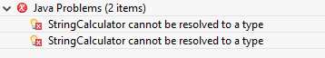

## Ejemplo 01: Kata Calculadora de Cadenas

### OBJETIVO

- Practicar el uso de TDD en la solución de un problema básico, con esto aprenderás como pasar por el ciclo RGR.

#### REQUISITOS

 1. JDK 8 o superior
 2. IDE de tu preferencia
 3. Apache Maven
 4. JUnit 5


#### DESARROLLO

Las instrucciones son las siguienes: 
- No leas por adelantado, la idea es que vayas resolviendo los problemas (los requerimientos) conforme se presentan.
- Haz una tarea a la vez, la intención es que aprendas a trabajar de forma incremental.
- Asegúrate de que solo realizas las pruebas para entradas válidas, no hay necesidad de probar entradas incorrectas.
- Escribe primero el código de la prueba, no importa si la aplicación no compila o la prueba es errorea, ese es el corazón de TDD =)

Problema 1: Crea una clase llamada StringCalculator con un método public int suma (String numeros); este método puede tomar 0,1 o 2 números como argumentos, y regresa su suma; para cadenas vacías regresará 0. Por ejemplo: 

 - "" regresará: 0.
 - "1" regresará 1.
 - "1,2" regresará 3.

Recuerda resolver el problema de la forma más simple posible y refactorizar después de cada fase.

1. Crea un nuevo proyecto Maven en Eclipse llamado KataStringCalculator:


2. Reemplaza el archivo pom.xml del proyecto con el siguiente:
```xml
	<project xmlns="http://maven.apache.org/POM/4.0.0"
		xmlns:xsi="http://www.w3.org/2001/XMLSchema-instance"
		xsi:schemaLocation="http://maven.apache.org/POM/4.0.0 http://maven.apache.org/xsd/maven-4.0.0.xsd">
		<modelVersion>4.0.0</modelVersion>
		<groupId>org.bedu.testing</groupId>
		<artifactId>kata-stringcalculator</artifactId>
		<version>0.0.1</version>

		<properties>
			<maven.compiler.source>11</maven.compiler.source>
			<maven.compiler.target>11</maven.compiler.target>
		</properties>

		<dependencies>
			<dependency>
				<groupId>org.junit.jupiter</groupId>
				<artifactId>junit-jupiter-api</artifactId>
				<version>5.5.2</version>
				<scope>test</scope>
			</dependency>
			<dependency>
				<groupId>org.junit.jupiter</groupId>
				<artifactId>junit-jupiter-engine</artifactId>
				<version>5.5.2</version>
			</dependency>
		</dependencies>

		<build>
			<plugins>
				<plugin>
					<groupId>org.apache.maven.plugins</groupId>
					<artifactId>maven-surefire-plugin</artifactId>
					<version>2.22.2</version>
				</plugin>
			</plugins>
		</build>
	</project>
```

3. Dentro de este proyecto crea una nueva clase llamada StringCalculatorTest. Como esta es una clase de prueba, debe estar en el paquete de pruebas de Maven: src/test/java. Al momento de crear el empaquetado de nuestra aplicación (ya sea un archivo jar o war) Maven excluirá todos los elementos de pruebas (clases, archivos de configuración, etc.). Así que podemos pensar en este como una zona segura para hacer nuestras pruebas.


3. Implementa la prueba para validar el primer requerimiento ("" regresa 0). El siguiente método nos ayudará a realizar esta prueba:
```java
	@Test
	void cadenaVacia() {
		StringCalculator calculator = new StringCalculator();
		assertEquals(0, calculator.add(""));
	}
```

No te preocupes, StringCalculator aún no existe ni tampoco el método add, pero esto nos ayuda a entender como podemos validar el requisito y por lo tanto como debe ser la estructura de nuestra clase para poder ser implementada y probada. Aquí ya estamos tomando algunas decisiones de diseño. Por ejemplo, hemos decidido que el método add sea un método de instancia (pudo haber sido un método estático).

2. Ejecutamos nuestra clase de prueba, con lo que debemos obtener el siguiente error de compilación:



No te preocupes por ese error, eso quiere decir que vamos bien en el proceso ;)

3. Crea la clase StringCalculator en la sección para clases productivas de Maven (src/main/java). En esta clase agregaremos nuestro primer método de instancia, el cual debe ser como se indica en los requerimientos:

```java
	public class StringCalculator {
		public int add(String numeros) {
		
		}
	}
```

Como se indica en las instrucciones: escribe el código necesario para que la prueba pase de manera correcta (no más, no menos) y este código debe ser lo más simple posible:

```java
	public int add(String numeros) {
		return 0;
	}
```

4. Ejecuta la prueba, con lo cual debes obtener una salida correcta:


5. Continúa con el siguiente requerimiento, si tienes como entrada un solo número el método debe regresar ese mismo número. Por ejemplo: "5" regresará 5.

Agrega un nuevo método en la clase de prueba:

```java
	@Test
	void numeroSoloRegresaMismoNumero() {
		StringCalculator calculator = new StringCalculator();
		assertEquals(5, calculator.add("5"));
	}
```

Si ejecutas nuevamente la prueba, debes obtener un error indicando que la prueba es incorrecta (Rojo):


6. Modifica la clase StringCalculator para hacer que la salida de las pruebas sea correcta (recuerda: el código más simple para que la prueba pase), en este caso modifica el método add de la sigueinte forma:

```java
	public int add(String numeros) {
		if(numeros.isEmpty())
			return 0;
		else
			return 5;
	}
```

Con esto la prueba debe ejecutarse de forma correcta (Verde):


7. Ahora que la prueba es correcta puedes refactorizar el código (tanto de la aplicación como el de la prueba). No hay mucho que mover a la clase StringCalculator, pero sí a StringCalculatorTest; en ambas pruebas hemos creado una instancia de StringCalculator. Podemos modificar la clase para hacer esta una variable de instancia, de esta forma:

```java
	public class StringCalculatorTest {

		private StringCalculator calculator = new StringCalculator();

		@Test
		void cadenaVacia() {
			assertEquals(0, calculator.add(""));
		}

		@Test
		void numeroSoloRegresaMismoNumero() {
			assertEquals(5, calculator.add("5"));
		}
	}
```
De esta forma nuestro código ha quedado más simple. 

8. Agrega otras pruebas a este último método:

```java
	@Test
	void numeroSoloRegresaMismoNumero() {
		assertEquals(5, calculator.add("5"));
		assertEquals(8, calculator.add("8"));
		assertEquals(2, calculator.add("2"));
	}
```

Si ejecutas la prueba nuevamente debes obtener un error (Rojo):


Por lo que nuevamente hay que regresar al método add para agregar el código que haga que la prueba pase:

```java
	public int add(String numeros) {
		if(numeros.isEmpty())
			return 0;
		else
			return Integer.parseInt(numeros);
	}
```

Con esto la prueba vuelve a ejecutarse de forma exitosa (Verde).


7. Implementa la última funcionalidad, un conjunto de números separados por comas debe dar como resultado la suma de cada uno de los números ("1,2" regresará 3).

8. Agrega la siguiente prueba, la cual ayudará a probar dos escenarios a la vez:

```java
	@Test
	void numerosSeparadosPorComas() {
		assertEquals(3, calculator.add("1,2"));
		assertEquals(4, calculator.add("1,3"));
	}
```

Si ejecutas la prueba, esta nuevamente debe fallar (Rojo):


10. Modifica el método add para que la prueba vuelva a ser exitosa.

```java
	public int add(String numeros) {
		if(numeros.isEmpty())
			return 0;
		else if	(numeros.contains(",")) {
			String[] elementos = numeros.split(",");
			return Integer.parseInt(elementos[0]) + Integer.parseInt(elementos[1]);
		}
		else
			return Integer.parseInt(numeros);
	}
```


Con esto la prueba nuevamente vuelve a ser exitosa (Verde).

Ahora que sabemos que la aplicación funciona de forma correcta, puedes Refactorizar el código del método add; esto es: cambiar su estructura pero sin modificar su funcionamiento. ¿Cómo puedes saber que está funcionando de la misma forma? ¡Fácil! porque tienes un conjunto de pruebas que se encargan de garantizar que su funcionamiento continua siendo el mismo.

11. Modifica el método add de la siguiente forma, para aprovechar los Streams de Java (Refactorizar):

```java
	public int add(String numeros) {
		if(numeros.isEmpty())
			return 0;

		Stream<String> elementos = Arrays.stream(numeros.split(","));
		return elementos.mapToInt(Integer::parseInt).sum();
	}
```

Con esta modificación, si ejecutas nuevamente tus pruebas puedes comprobar que la aplicación continúa funcionando de forma correcta:


Esta es la escencia de TDD, ahora tienes un código funcional, y un conjunto de pruebas para distintos casos de uso. Si modificas una funcionalidad puedes saber si esta causa algún problema en alguna otra parte de la aplicación.
