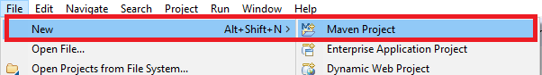
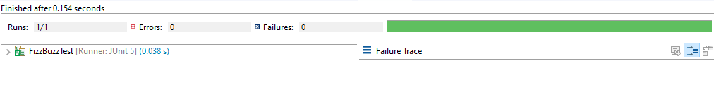
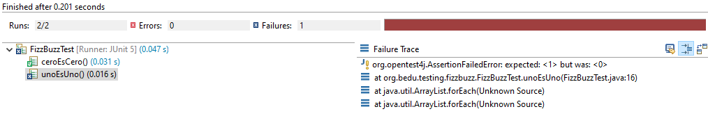
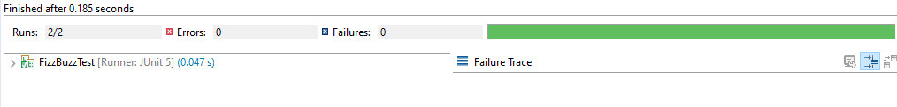
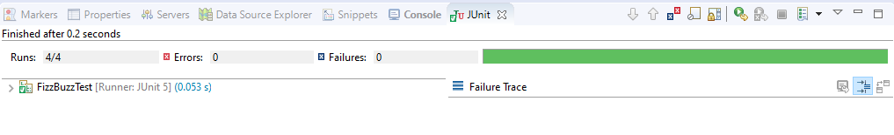
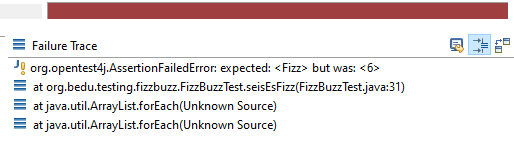

## Kata FizzBuzz

### OBJETIVO

- Practicar el uso de TDD en la solución de un problema intermedio, seguir practicando el ciclo RGR y mejorar tus hablidades en escritura de pruebas unitarias usando JUnit.

#### REQUISITOS

1. JDK 11
2. IDE Eclipse
3. JUnit 5

#### DESARROLLO

Este es un juego clásico de programación. En él tu eres un niño de 11 años, cinco minutos antes de que termine la clase, tu profesor de matemáticas decide que la clase debe ser más "divertida" haciendo un "juego". Explica que va a señalar a cada uno de los miembros de la clase y pedirle que diga el siguiente número de la secuencia, iniciando en el 1. La parte "divertida" es que si el número es divisible entre 3 en vez de decir el número se debe decir "Fizz" y si es divisible entre 5 se debe decir "Buzz". 

Tu profesor comienza a señalar a cada uno de tus compañeros, y cada uno va diciendo alegremente "1", "2", "Fizz", "cuatro", "Buzz"... de repente, tu profesor te señala a tí... no sabes que decir así que comienzas a ponerte nervioso, se te seca la boca y tus manos comienzan a sudar hasta que finalmente logras decir "Fizz". Tu profesor continúa señalando al resto de tus compañeros.

Para evitar el pasar verguenza frente a tus compañeros de clase, y puesto que eres un gran programador, se te ocurre imprimir la lista completa de toda la secuencia. Tu clase tiene 33 integrantes y hay tiempo para darle la vuelta tres veces antes de que suene la campana de salida. La siguiente clase es mañana así que pones manos en el teclado y comienzas a codificar. 

Escribe un programa que imprima los números del 1 al 100. Si el número es múltiplo de 3 debe imprimir "Fizz" en ve del número y si el número es múltiplo de 5 debe imprimir "Buzz". Para números que son múltiplos de ambos se debe imprimir "FizzBuzz". 

Esta es una salida de ejemplo:

1
2
Fizz
4
Buzz
Fizz
7
8
Fizz
Buzz
11
Fizz
13
14
FizzBuzz
16
17
Fizz
19
Buzz
... etc 

Las instrucciones son las siguienes: 
- Haz una tarea a la vez, la intención es que aprendas a trabajar de forma incremental.
- Asegúrate de que solo realizas las pruebas para entradas válidas, no hay necesidad de probar entradas incorrectas.
- Escribe primero el código de la prueba, no importa si la aplicación no compila o la prueba es errorea, ese es el corazón de TDD =)

Recuerda resolver el problema de la forma más simple posible y refactorizar después de cada fase.

1. Crea un nuevo proyecto Maven en Eclipse llamado KataFizzBuzz



2. Reemplazar el archivo pom.xml del proyecto con el siguiente:
```xml
	<project xmlns="http://maven.apache.org/POM/4.0.0"
		xmlns:xsi="http://www.w3.org/2001/XMLSchema-instance"
		xsi:schemaLocation="http://maven.apache.org/POM/4.0.0 http://maven.apache.org/xsd/maven-4.0.0.xsd">
		<modelVersion>4.0.0</modelVersion>
		<groupId>org.bedu.testing</groupId>
		<artifactId>kata-fizzbuzz</artifactId>
		<version>0.0.1</version>

		<properties>
			<maven.compiler.source>11</maven.compiler.source>
			<maven.compiler.target>11</maven.compiler.target>
		</properties>

		<dependencies>
			<dependency>
				<groupId>org.junit.jupiter</groupId>
				<artifactId>junit-jupiter-api</artifactId>
				<version>5.5.2</version>
				<scope>test</scope>
			</dependency>
			<dependency>
				<groupId>org.junit.jupiter</groupId>
				<artifactId>junit-jupiter-engine</artifactId>
				<version>5.5.2</version>
			</dependency>
		</dependencies>

		<build>
			<plugins>
				<plugin>
					<groupId>org.apache.maven.plugins</groupId>
					<artifactId>maven-surefire-plugin</artifactId>
					<version>2.22.2</version>
				</plugin>
			</plugins>
		</build>
	</project>
```

3. Dentro de este proyecto crea una nueva clase llamada FizzBuzzTest. Como esta es una clase de prueba, debe estar en el paquete de pruebas de Maven: src/test/java. Al momento de crear el empaquetado de nuestra aplicación (ya sea un archivo jar o war) Maven excluirá todos los elementos de pruebas (clases, archivos de configuración, etc.). Así que podemos pensar en este como una zona segura para hacer nuestras pruebas.


4. Comenzaremos definiendo la prueba para un método principal de la aplicación, el cual debe cumplir con las siguientes reglas:
 - Debe recibir un entero que sea mayor o igual o cero.
 - Si es divisible entre tres debe regregsar "Fizz".
 - Si es divisible entre cinco debe regresar "Buzz".
 - Si es divisible entres tres y cinco debe regregsar "FizzBuzz".
 - Si no se cumple ninguna de las tres condiciones anteriores, debe regresar el mismo número.
 
 5. Dentro de la clase de prueba comencemos con un método que se asegure que si recibe 0 como parámetro, este regrese el valor de "0":
 
```java
	@Test
	void ceroEsCero() {
		assertEquals("0", FizzBuzz.valorSecuencia(0));
	}
```
 
6. Si tratas de ejecutar la prueba, obtendrás un error de compilación ya que la clase FizzBuzz no existe todavía, y por lo tanto no tiene un método valorSecuencia; así que hay que agregar esta clase, en el código productivo del proyecto (src/main/java) y dentro de esta el método valorSecuencia:

```java
	public class FizzBuzz {
		public static String valorSecuencia(int valor) {
			return "0";
		}
	}
```

Si volvemos a ejecutar la prueba esta debe pasar de forma correcta. 



3. Agregaremos otra prueba para validar que 1 regresa el valor de "1", de esta forma:

```java
	@Test
	void unoEsUno() {
		assertEquals("1", FizzBuzz.valorSecuencia(1));
	}
```

Si ejecutamos esta prueba, debe fallar:



4. Ahora, escriba el código que hace que la prueba pase; en este caso, será tan sencillo como modificar el método valorSecuencia de la siguiente forma:

```java
	public static String valorSecuencia(int valor) {
		return String.valueOf(valor);
	}
```

5. Ejecuta nuevamente la prueba y esta debe pasar de manera correcta:



6. El siguiente paso debería ser probar el valor de 2, pero como esta prueba es similar a la anterior pasaremos a probar el valor de "3". Recordemos que este método en vez de regresar 3 debe regresar "Fizz", de la siguiente forma:

```java
	@Test
	void tresEsFizz() {
		assertEquals("Fizz", FizzBuzz.valorSecuencia(3));
	}
```

Si ejecutamos nuevamente la prueba esta debe fallar.

7. Ahora, hay que escribir el código que haga pasar la prueba, en este caso la modificación queda de la siguiente forma:

```java
	public static String valorSecuencia(int valor) {
		
		if(3 == valor) {
			return "Fizz";
		} 
		
		return String.valueOf(valor);
	}
```

Si volvemos a ejecutar la preba esta pasará de manera correcta.

8. Hagamos algo similar para el valor "5", el cual debe regresar "Buzz", primero la prueba:

```java
	@Test
	void cincoEsBuzz() {
		assertEquals("Buzz", FizzBuzz.valorSecuencia(5));
	}
```

Si ejecutamos la prueba esta no pasará.

9. Coloquemos el código que haga pasar la prueba, en este caso:

```java
	public static String valorSecuencia(int valor) {
		
		if(3 == valor) {
			return "Fizz";
		} 
		
		if(5 == valor) {
			return "Buzz";
		}
		
		return String.valueOf(valor);
	}
```

Si ejecutamos la prueba esta pasará de manera correcta.



10. El siguiente valor a probar es el 6, el cual debe regresar el valor de "Fizz", de la siguiente forma:

```java
	@Test 
	void seisEsFizz() {
		assertEquals("Fizz", FizzBuzz.valorSecuencia(6));
	}
```

Si ejecutamos la prueba, esta nuevamente fallará:

 

11. Para hacer que la prueba pase, hay que hacer una ligera modificación a la primera condición, de la siguiente forma:

```java
		if(valor % 3 == 0) {
			return "Fizz";
		} 
		
```

Si ejecutas nuevamente la prueba esta... ¿falla? La prueba no se ejecuta exitosamente, pero es una prueba anterior, una que ya funcionaba correctamtente. ¿Qué es lo que ocurre aquí? Agregamos una nueva funcionalidad y esta hizo que la aplicación dejara de funcionar en un lugar que no nos esperábamos. Con los test pudimos darnos cuenta de esto antes de liberar el producto =).

Para arreglarlo, debemos hacer la siguiente modificación al código:

```java
	public static String valorSecuencia(int valor) {

		if(valor == 0) {
			return "0";
		}
		
		if(valor % 3 == 0) {
			return "Fizz";
		} 
		
		if(5 == valor) {
			return "Buzz";
		}
		
		return String.valueOf(valor);
	}
```

Si ejecutas nuevamente la aplicación, la prueba debe pasar correctamente. 

12. El siguiente valor interesante es 10, el cual debe regresar "Buzz":

```java
	@Test 
	void diezEsBuzz() {
		assertEquals("Buzz", FizzBuzz.valorSecuencia(10));
	}
```

Si ejecutas la prueba esta nuevamente fallará. 

13. Para hacer pasar la prueba hay que hacer la ssiguiente modificación a la tercera condición:

```java
	if(valor % 5 == 0) {
		return "Buzz";
	}
```

La prueba nuevamente vuelve a pasar.

14. El siguiente valor interesante es el 15, ya que este es divisible tanto por 3 como por 5, por lo que escribimos el código e la prueba:

```java
	@Test 
	void quinceEsFizzBuzz() {
		assertEquals("FizzBuzz", FizzBuzz.valorSecuencia(15));
	}
	
```

Si ejecutamos la prueba, esta nuevamente fallará.

15. Para hacer que la prueba nuevamente pase, podemos hacer algo como lo siguiente:

```java
	public static String valorSecuencia(int valor) {

		if(valor == 0) {
			return "0";
		}
		
		if(valor % 3 == 0 && valor % 5 == 0) {
			return "FizzBuzz";
		}
		
		if(valor % 3 == 0) {
			return "Fizz";
		} 
		
		if(valor % 5 == 0) {
			return "Buzz";
		}
		
		return String.valueOf(valor);
	}
```

Si ejecutas la prueba, este nuevemente debe ser correcta.

16. Ahora que ya hemos cubierto todos los casos, ¿podemos dar por terminado el ejemplo? Ya casí, pero aún no. Si bien este ya funciona aún hay que mejorar nuestro código productivo, ya que tenemos un método con muchas instrucciones return. Es mejor y más ordenado tener solo una, por lo que podemos hacer la siguiente modificación:

```java
	public static String valorSecuencia(int valor) {

		String regreso = "";
		
		if(valor == 0) {
			return "0";
		}
		
		if(valor % 3 == 0 && valor % 5 == 0) {
			regreso = "FizzBuzz";
		}
		
		if(valor % 3 == 0) {
			regreso =  "Fizz";
		} 
		
		if(valor % 5 == 0) {
			regreso = "Buzz";
		}
		
		return regreso.isEmpty() ? String.valueOf(valor) : regreso;
	}
```
El código ya se ve mucho más ordenado. Ejecuta nuevamente la prueba y... ¡UPS! algo se rompió. Que bueno que con nuestras pruebas unitarias nuevamente nos dimos cuenta de que algo estaba mal =).

Arreglemos esto de la siguiente forma:

```java
	public static String valorSecuencia(int valor) {

		String regreso = "";
		
		if(valor == 0) {
			return "0";
		}
		
		if(valor % 3 == 0) {
			regreso =  "Fizz";
		} 
		
		if(valor % 5 == 0) {
			regreso = "Buzz";
		}
		
		if(valor % 3 == 0 && valor % 5 == 0) {
			regreso = "FizzBuzz";
		}
		
		return regreso.isEmpty() ? String.valueOf(valor) : regreso;
	}
```

Con esto la prueba nuevamente se ejecuta de manera correcta.

17. El código se ve mejor después de la refactorización, sin embargo esas condiciones duplicadas pueden simplificarse si hacemos el siguiente cambio:

```java
	public static String valorSecuencia(int valor) {

		String regreso = "";
		
		if(valor == 0) {
			return "0";
		}
		
		if(valor % 3 == 0) {
			regreso +=  "Fizz";
		} 
		
		if(valor % 5 == 0) {
			regreso += "Buzz";
		}
		
		
		return regreso.isEmpty() ? String.valueOf(valor) : regreso;
	}
```

Con esto, el codigo se simplifica y la prueba sigue pasando de forma correcta y podemos dar por terminado el ejercicio.
