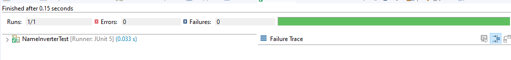
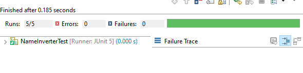

## Kata Nombre Invertido

### OBJETIVO 

- Practicar el uso de TDD a través de su implementación en una Kata de nivel intermedio.

#### REQUISITOS 

1. JDK 8
2. JUnit 5.
3. IDE Eclipse.

#### DESARROLLO

Este reto consiste en implementar la Kata de nombres invertidos, la cual indica que dado un nombre, por ejemplo: John Smith, la aplicación debe regresar el nombre en e formato Apellido, Nombre; en el ejemplo anterior la salida esperada es: Smith, John.

Para este requerimiento plantearemos algunas reglas:

 - Si la cadena de entrada tiene espacios adicionales en blanco, estos espacios deben ser eliminados en la salida. Por ejemplo: John      Smith -> Smith, John
 - Si el nombre es un valor nulo (null) se debe lanzar una NullPointerException
	
1. Crea un nuevo proyecto Maven en Eclipse llamado KataNameInverter

2. Reemplazar el archivo pom.xml del proyecto con el siguiente:
```xml
	<project xmlns="http://maven.apache.org/POM/4.0.0"
		xmlns:xsi="http://www.w3.org/2001/XMLSchema-instance"
		xsi:schemaLocation="http://maven.apache.org/POM/4.0.0 http://maven.apache.org/xsd/maven-4.0.0.xsd">
		<modelVersion>4.0.0</modelVersion>
		<groupId>org.bedu.testing</groupId>
		<artifactId>kata-nameinverter</artifactId>
		<version>0.0.1</version>

		<properties>
			<maven.compiler.source>8</maven.compiler.source>
			<maven.compiler.target>8</maven.compiler.target>
		</properties>

		<dependencies>
			<dependency>
				<groupId>org.junit.jupiter</groupId>
				<artifactId>junit-jupiter-api</artifactId>
				<version>5.5.2</version>
				<scope>test</scope>
			</dependency>
			<dependency>
				<groupId>org.junit.jupiter</groupId>
				<artifactId>junit-jupiter-engine</artifactId>
				<version>5.5.2</version>
			</dependency>
		</dependencies>

		<build>
			<plugins>
				<plugin>
					<groupId>org.apache.maven.plugins</groupId>
					<artifactId>maven-surefire-plugin</artifactId>
					<version>2.22.2</version>
				</plugin>
			</plugins>
		</build>
	</project>
```

3. Dentro de este proyecto crea una nueva clase llamada NameInverterTest. Como esta es una clase de prueba, debe estar en el paquete de pruebas de Maven: src/test/java. Al momento de crear el empaquetado de nuestra aplicación (ya sea un archivo jar o war) Maven excluirá todos los elementos de pruebas (clases, archivos de configuración, etc.). Así que podemos pensar en este como una zona segura para hacer nuestras pruebas.


4. Comencemos con la prueba más simple, en el que se validamos si el nombre recibido es null. Según los requisitos, en ese caso se debe lanzar una NullPointerException.

```java
	@Test
	void nullLanzaExcepcion() {
		try {
			
			NameInverter.invierte(null);
			
			fail("Error, se esperaba una Excepcion no lanzada");
		}catch (NullPointerException e) {
		}

	}
```

Como podemos ver, aquí ya estamos tomando nuevameente decisiones de diseño. Lo primero es que la clase que implementará la funcionalidad se llama NameInverter, y la funcionalidad principal será implementada en un método llamado invierte, el cual es estático y recibe el valor (en este caso el nombre) a invertir.

Si ejecutamos nuestra prueba, esta nisiquiera debe compilar ya que la clase NameInverter no existe.

5. Escribe el código más simple que haga que pase la prueba:

```java
	public class NameInverter {
		public static String invierte(String nombre) {
			throw new NullPointerException();
		}
	}
```
Si ejecutas nuevamente la prueba, esta debe pasar de manera correcta:


	
6. En la siguiente prueba pasaremos un nombre en forma de una cadena vacía Como no se indica qué debe pasar en este caso, regregsaremos también una cadena vacía como nombre:

```java
	@Test
	void nombreVacioEsCadenaVacia() {
		assertEquals("", NameInverter.invierte(""));
	}
```

Nuevamente si ejecutas la prueba esta fallará. 

7. Escribe el código mínimo para que la prueba pase, en este caso tenemos: 

```java
	public static String invierte(String nombre) {
		
		if(null == nombre) {
			throw new NullPointerException();
		}
		
		return "";
	}
```

Ejecuta tu prueba para comprobar que esta nuevamente pasa de manera correcta.

8. En la siguiente prueba verificaremos qué pasa si solo pasamos un nombre (es decir: sin apellido). En ese caso regresaremos el mismo nombre:

```java
	@Test
	void nombreSoloRegresaNombre() {
		assertEquals("John", NameInverter.invierte("John"));
	}
```

9. Escribe el código que haga que la prueba pase:

```java
	public static String invierte(String nombre) {
		
		if(null == nombre) {
			throw new NullPointerException();
		}
		
		return nombre;
	}
```

10. En la siguiente prueba probarás la funcionalidad core de la Kata, en la que pasando un nombre y apellido se debe regresar el valor con el formato apellido, nombre:

```java
	@Test
	void nombreApellidoRegresaApellidoNombre() {
		assertEquals("Smith, John", NameInverter.invierte("John Smith"));
	}
```

11. Escribe el código que haga que la prueba pase de forma correcta:

```java
	public static String invierte(String nombre) {
		
		if(null == nombre) {
			throw new NullPointerException();
		}
		
		String[] elementosNombre = nombre.split(" ");
		
		if(elementosNombre.length > 1)
			return String.format("%s, %s", elementosNombre[1], elementosNombre[0]);
		
		return elementosNombre[0];
	}
```

Ejecuta nuevamente la prueba para que compruebes que funcionó correctamente.

12. Prueba el requerimiento que indica que los espacios en blanco excedentes deben eliminarse. Esto podemos comprobarlo con la siguiente prueba unitaria.

```java
	@Test 
	void eliminaEspaciosBlancos() {
		assertEquals("Smith, John", NameInverter.invierte("John      Smith   "));
		assertEquals("John", NameInverter.invierte("John      "));
	}
```

13. Escribe el código necesario para que la prueba vuelva a pasar.

```java
	public static String invierte(String nombre) {
		
		if(null == nombre) {
			throw new NullPointerException();
		}
		
		String[] elementosNombre = nombre.trim().split("\\s+");
		
		if(elementosNombre.length > 1)
			return String.format("%s, %s", elementosNombre[1], elementosNombre[0]);
		
		return elementosNombre[0];
	}
```

14. Como paso final, revisa el código de la clase NameInverter para ver cómo puedes simplificarlo (refactorizando) mientras que las pruebas siguen ejecutándose correctamente. Tip: hay por lo menos una instrucción que puedes eliminar.

```java
	public static String invierte(String nombre) {
			
		String[] elementosNombre = nombre.trim().split("\\s+");
		
		if(elementosNombre.length > 1)
			return String.format("%s, %s", elementosNombre[1], elementosNombre[0]);
		
		return elementosNombre[0];
	}
```

15. Finalmente, ejecuta nuevamente las pruebas para comprobar que todo continúa funcionando correctamente:


