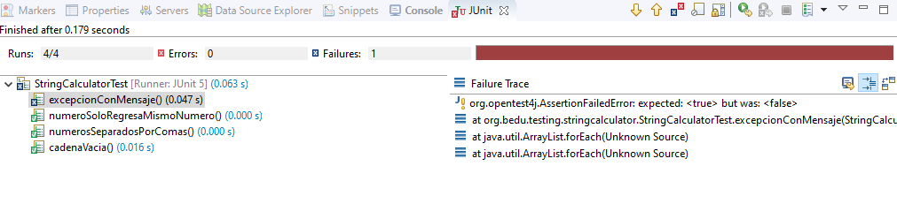
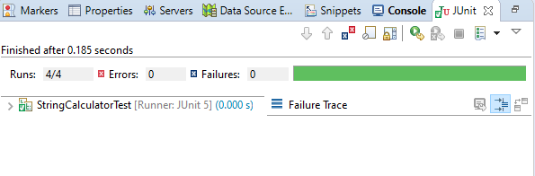
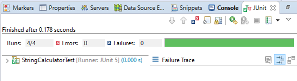
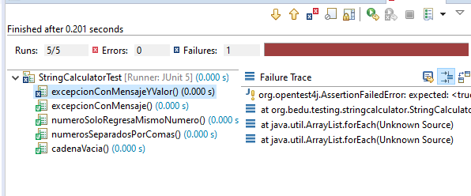
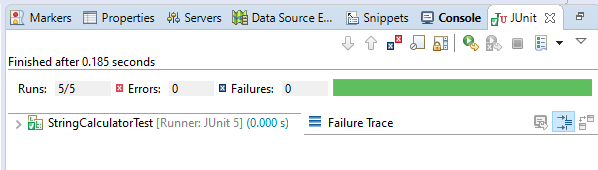
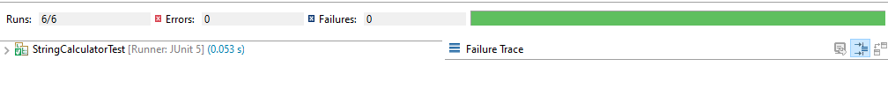

## Reto 01: Kata Calculadora de Cadenas parte 2

### OBJETIVO 

- Continuar con el aprendizaje de TDD agregando requisitos adicionales a la calculadora de cadenas de el Ejercicio anterior.

#### REQUISITOS 

 1. JDK 8 o superior
 2. IDE de tu preferencia
 3. Apache Maven
 4. JUnit 5
 5. Ejercicio-01 calculadora de Cadenas

#### DESARROLLO

En este reto tendrás que agregar algunas funcionalidades adicionales a la calculadora de cadenas visto en el primero ejemplo. 

Recuerda: debes ir avanzando requisito por requisito; primero escribe el código de las pruebas; escribe solamente el código necesario para que la prueba que acabes de escribir pase de forma exitosa.

 - Requisito 1: Llamar al método add con números negtivos debe lanzar una excepción con el mensaje "no se admiten números negativos".
 - Requisito 2: El mensaje de error de la excepción lanzada debe contener el número negativo que se está pasando. Por ejemplo, si el -método recibe un -3 el mensaje debe decir "no se admiten números negativos [-3]".
 - Requisito 3: Si hay múltiples números negativos, el mensaje debe contenerlos a todos.

<details>
	<summary>Solución</summary>

<p>1. Agrega la prueba en la clase StringCalculatorTest:</p>

```java
	@Test
	void excepcionConMensaje() {
		try {
			calculator.add("1,-2,5");
			fail("La aplicación no debe llegar a este punto");
		}catch (IllegalArgumentException ex) {
			assertTrue(ex.getMessage().contains("no se admiten números negativos"));
		}
	}
```

Aquí, nuevament vemos que estamos tomando algunas decisiones de diseño, ya que estamos decidiendo que la excepción lanzada sea una IllegalArgumentException. En el código anterior el método fail se llamará si add no lanza una exepción. En el bloque catch comprobamos que la excepción lanzada contenga el texto que estamos esperando.

2. Ejecuta la prueba, esta debe fallar ya que la funcionalidad no está implementada aún (Rojo). 



3. Agrega una comparación; aprovechando que estamos usando Streams, buscaremos si algún número es menor a cero, de ser así lanzaremos la excepción:

```java
	public int add(String numeros) {
		if(numeros.isEmpty())
			return 0;

		if(Arrays.stream(numeros.split(",")).mapToInt(Integer::parseInt).anyMatch(n -> n < 0)) {
			throw new IllegalArgumentException("no se admiten números negativos");
		}
		
		Stream<String> elementos = Arrays.stream(numeros.split(","));
		return elementos.mapToInt(Integer::parseInt).sum();
	}
```

4. Ejecuta nuevamente la prueba, con esto la misma debe pasar de manera exitosa (Verde):




5. Si eres observador notaras que la línea que acabamos de agregar se parce mucho a la instrucción que está al final del método: 

```java
	Arrays.stream(numeros.split(",")).mapToInt(Integer::parseInt)
```

Podemos aprovechar para refactorizar el código del metodo add para simplificarlo un poco. Primero agregamos el siguiente método:

```java
	private IntStream getNumeros(String numeros) {
		return Arrays.stream(numeros.split(",")).mapToInt(Integer::parseInt);
	}
```

y después, modificamos el método add de la siguiente forma:

```java
	public int add(String numeros) {
		if(numeros.isEmpty())
			return 0;

		if(getNumeros(numeros).anyMatch(n -> n < 0)) {
			throw new IllegalArgumentException("no se admiten números negativos");
		}
		
		return getNumeros(numeros).sum();
	}
```

Como puedes ver, acabamos de simplificar el método y si ejecutas nuevamente la prueba, podrás comprobar que esta sigue pasando correctamente (Refactorizar).




6. Ahora implementa el segundo requisito. El mensaje debe incluir en su texto el número negativo. Para esto nuevamente inicia escribiendo la prueba:

```java
	@Test 
	void excepcionConMensajeYValor() {
		try {
			calculator.add("1,-2,5");
			fail("La aplicación no debe llegar a este punto");
		}catch (IllegalArgumentException ex) {
			assertTrue(ex.getMessage().contains("no se admiten números negativos [-2]"));
		}
	}
```


7. Ejecuta la prueba y esta nuevamente debe dar error (Rojo):



8. Implementa el código que haga que la prueba pase, modifica el método add de la siguiente forma:

```java
	public int add(String numeros) {
		if(numeros.isEmpty())
			return 0;

		OptionalInt resultado =  getNumeros(numeros).filter(n -> n < 0).findFirst();
		
		if(resultado.isPresent()) {
			throw new IllegalArgumentException("no se admiten números negativos [" + resultado.getAsInt() + "]");
		}
		
		return getNumeros(numeros).sum();
	}
```

9. Ejecuta nuevamente la prueba y esta debe ser exitosa:



10. Implementa el último requisito, si hay más de un número negativo el mensaje debe contenerlos todos. Nuevamente, comienza con el código de la prueba:


```java
	@Test 
	void excepcionConMensajeYValorMultiplesNumeros() {
		try {
			calculator.add("1,-2,5,-7,-15");
			fail("La aplicación no debe llegar a este punto");
		}catch (IllegalArgumentException ex) {
			assertTrue(ex.getMessage().contains("no se admiten números negativos [-2, -7, -15]"));
		}
	}
```

Si ejecutas la prueba esta debe dar como resultado un error (Rojo).


11. Escribe el código que haga que la prueba pase. En este caso modifica el método add de la siguiente forma:

```java
	public int add(String numeros) {
		if (numeros.isEmpty())
			return 0;

		String negativos = getNumeros(numeros).filter(n -> n < 0).mapToObj(Integer::toString)
				.collect(Collectors.joining(","));
		
		if (!negativos.isEmpty()) {
			throw new IllegalArgumentException("no se admiten números negativos [" + negativos +"]");
		}

		return getNumeros(numeros).sum();
	}
```


12. Ejecuta nuevamente la prueba, en esta ocasión debe ejecutarse de manera correcta (Verde).



</details> 
