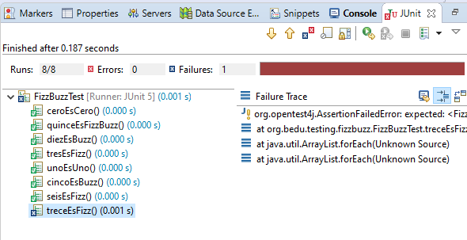

## Reto 02: Kata FizzBuzz parte 2

### OBJETIVO 

- Practicar el uso de TDD a través de su implementación en una Kata de nivel intermedio.

#### REQUISITOS 

1. JDK 8 o superiór. 
2. JUnit 5.
3. IDE de tu preferencia.
4. Ejercicio 02: Primera parte de la Kata FizzBuzz

#### DESARROLLO

En este reto agregaremos un par de requisitos a la Kata FizzBuzz que hicimos en el Ejemplo-02:

 - Se debe imprimir Fizz si un número es múltiplo de 3 o si tiene un 3 en él. 
 - Se debe imprimir Buzz si un número es múltiplo de 5 o si tiene un 5 en él.
 - Se debe imprimir FizzBuzz si un número es múltiplo de 3 o 5 o si contiene un 3 o 5 en él.

<details>
	<summary>Solucion</summary>
	
1. Regresa al proyecto KataFizzBuzz que hicimos en el Ejemplo-02

2. Agrega la prueba para validar el funcionamiento del primer requerimiento, donde validaremos si la cadena contiene un 3 en ella, pero sin ser múltiplo de 3; en este caso seleccionamos el número 13. 

```java
	@Test
	void treceEsFizz() {
		assertEquals("Fizz", FizzBuzz.valorSecuencia(13));
	}
```

Si ejecutas la prueba esta debe fallar:


	
3. Escribe el código para que la prueba pase de manera correcta, en este caso modifica la condición en la que se valida si el número es múltiplo de 3, para agregar una nueva condición en la que conviertas el número a cadena y uses el método contains para validar si este contiene un número 3:

```java
	public static String valorSecuencia(int valor) {

		String regreso = "";
		
		if(valor == 0) {
			return "0";
		}
		
		if(valor % 3 == 0 || String.valueOf(valor).contains("3")) {
			regreso +=  "Fizz";
		} 
		
		if(valor % 5 == 0) {
			regreso += "Buzz";
		}
		
		
		return regreso.isEmpty() ? String.valueOf(valor) : regreso;
	}
```

Ejecuta nuevamente la prueba para comprobar que se ejecuta de forma correcta.

4. Escribe la prueba para validar el segundo requisito, en el que se debe validar si el número contiene un 5. En este caso elegimos el número 25:

```java
	@Test
	void veinticincoEsBuzz() {
		assertEquals("Buzz", FizzBuzz.valorSecuencia(25));
	}
```

Ejecuta nuevamente la prueba... esta debe pasar sin problema porque todos los números que contienen un 5 son múltiplos de 5, por lo que ya tenemos cubierto ese caso =).


5. Agrega el código para validar el último requerimiento, en este caso usaremos el número 35, que contiene tanto un 3 como un 5:
```java
	@Test
	void treintaycincoEsFizzBuzz() {
		assertEquals("FizzBuzz", FizzBuzz.valorSecuencia(35));
	}
```

6. Escribe el código para que la prueba se ejecute de forma correcta. En este caso ocurre algo similar al segundo requerimiento: ya con el código que ya hemos escrito, por lo que el método valorSecuencia debe quedar más o menos de la siguiente forma:

```java
	public static String valorSecuencia(int valor) {

		String regreso = "";
		
		if(valor == 0) {
			return "0";
		}
		
		if(valor % 3 == 0 || String.valueOf(valor).contains("3")) {
			regreso +=  "Fizz";
		} 
		
		if(valor % 5 == 0) {
			regreso += "Buzz";
		}
		
		
		return regreso.isEmpty() ? String.valueOf(valor) : regreso;
	}
```

</details> 
