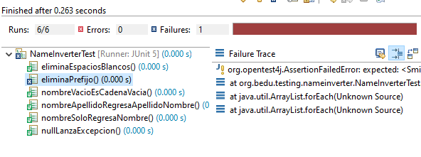

## Kata Nombre Invertido parte 2

### OBJETIVO 

- Practicar el uso de TDD a través de su implementación en una Kata de nivel intermedio.

#### REQUISITOS 

1. JDK 8
2. JUnit 5.
3. IDE Eclipse.
4. Código del Ejemplo-02 Kata nombre invertido

#### DESARROLLO

Agregaremos dos requerimmientos adicionales a la Kata de Nombre invertido del Ejemplo-03:

 - Si el nombre tiene algún prefijo (también llamado honorífico), este debe ser eliminado en la salida. Por ejemplo: Sr. John Smith -> Smith, John.
 - Si el nombre tiene algún posfijo, este debe ser respetado. Por ejemplo: John Smith Jr. -> Smith, John Jr. o
 	- John Smith Jr. -> Smith, John Jr.
	- John Smith PhD. -> Smith, John PhD.
	- John Smith Jr. PhD. -> Smith, John Jr. PhD.

<details>
	<summary>Solucion</summary>
	
1. Abre el código del Ejemplo-02 Kata Nombre Invertido.

2. Agrega la prueba para validar el primer requerimiento:

```java
	@Test
	void eliminaPrefijo() {
		assertEquals("Smith, John", NameInverter.invierte("Sr. John Smith"));
	}
```
Ejecuta la prueba para que compruebes que falla. 



3. Agrega el código que hace que la prueba se ejecute de forma correcta.

```java
	public static String invierte(String nombre) {
			
		List<String> elementosNombre =  new ArrayList<String>(Arrays.asList(nombre.trim().split("\\s+")));
		
		if("Sr.".equals(elementosNombre.get(0))) {
			elementosNombre.remove(0);
		}
		
		if(elementosNombre.size() > 1)
			return String.format("%s, %s", elementosNombre.get(1), elementosNombre.get(0));
		
		return elementosNombre.get(0);
	}
```
En el código anterior, reemplazamos el arrelo de String que veníamos usando, con un ArrrayList; de esta forma se facilita el eliminar el elemento del índice indicado (0).

Ejecuta nuevamente la prueba para comprobar que funciona correctamente:


</details> 

