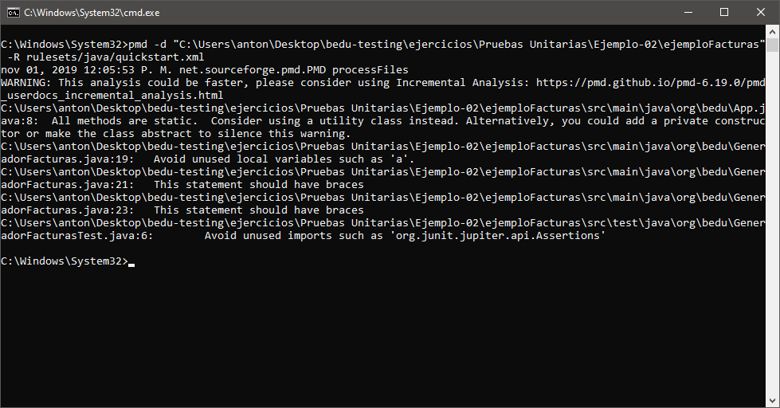

## Ejemplo 01: Instalación de una herramienta de análisis de calidad

### Objetivo
- Instalar una herramienta de análisis estático de código para poder ejecutarla y realizar análisis de la calidad de nuestras aplicaciones.

### Requisitos
1. JRE y JDK 8 o superior
2. Descompresor de archivos zip
3. Apache Maven

### Desarrollo
Para esta guía emplearemos la herramienta PMD, que permite encontrar fallos comunes como variables no usadas, bloques catch vacíos, creación innecesaria de objetos o código duplicado y funciona para varios lenguajes incluyendo Java, Javascript, Apex, XML, etc.
Permite que definamos nuestras propias reglas para definir qué se considera un error y qué no, pero también incluye un conjunto predefinido que se puede usar desde su instalación.

PMD puede instalarse en el sistema y usarse como aplicación de línea de comandos o puede integrarse como un objetivo de Maven. En este ejercicio realizaremos ambos métodos.

#### Instalación para usarse en línea de comandos
1. Accederemos a la página principal de PMD, en <a href="https://pmd.github.io/">https://pmd.github.io/</a> donde encontraremos el botón para descargar la última versión.


2. Obtendremos un archivo zip que deberemos extraer en una carpeta de nuestra elección:


3. Posteriormente, añadiremos la subcarpeta **bin** al **PATH** de nuestro sistema, en Windows será de la siguiente manera:


4. En Linux, desde una terminal ejecutaremos el comando `export PATH=$PATH:/home/pmd-bin-6.19.0/bin`

5. Podremos comprobar que PMD está correctamente instalado ejecutando `pmd` desde cmd en Windows o desde bash en Linux:


6. Para ejecutar el análisis de una aplicación emplearemos el comando `pmd.bat` en Windows o `run.sh pmd`, mismo que requiere 2 argumentos:
- -d _ruta_ donde ruta apunta a un archivo, carpeta, jar o zip que contenga el código
- -R _ruta_ donde ruta apunta al archivo xml con las reglas a emplear. PMD incluye un conjunto predefinido al que se puede acceder con la ruta `rulesets/java/quickstart.xml`

7. Los resultados del análisis se nos presentarán en la consola, con la ruta a cada archivo.


#### Instalación para ejecutarse como un objetivo de Maven
1. La instalación mediante Maven nos permite elegir si solo generaremos reportes del proyecto o detendremos la construcción si se encuentran problemas. En este ejercicio incluiremos ambas opciones.

2. Para generar un reporte de un proyecto, agregaremos lo siguiente al archivo **pom.xml** de nuestro proyecto:
```xml
<project>
    ...
    <reporting>
        <plugins>
            <plugin>
                <groupId>org.apache.maven.plugins</groupId>
                <artifactId>maven-pmd-plugin</artifactId>
            </plugin>
        </plugins>
    </reporting>
    ...
</project>

```

3. Ejecutaremos el análisis de PMD mediante la consola en la carpeta raíz del proyecto, con el comando `mvn pmd:pmd`


4. Los resultados del análisis se escribirán en el archivo `target/pmd.xml`, que mostrará el nombre del archivo y la ubicación de cada problema:


