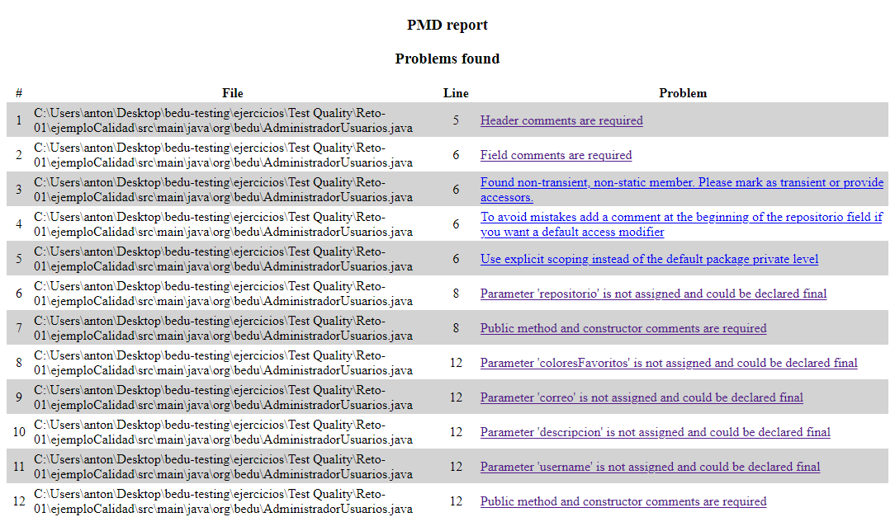

## Ejemplo 02: Análisis de calidad mediante PMD en línea de comandos

### Objetivo
- Emplear una herramienta de análisis de calidad para encontrar problemas en una aplicación previamente desarrollada e interpretar el resultado de los reportes presentados por ésta.

### Requisitos
1. JRE y JDK 8 o superior
2. Haber instalado PMD para usarse mediante línea de comandos (en base al ejercicio 1)

### Desarrollo
En este ejemplo realizaremos un simple análisis a una aplicación previamente desarrollada que contiene problemas de calidad, dicha aplicación se encuentra en la carpeta **ejemploCalidad**.
Los pasos a seguir para realizar un análisis por PMD mediante la línea de comandos son los siguientes:

1. Como vimos durante la instalación de PMD, el comando principal para su uso es `pmd.bat` en Windows y `run.sh pmd` en Linux. Este comando requiere mínimo 2 argumentos para realizar un análisis: `-d` que le especifica la carpeta donde se encuentra el código a analizar y `-R` que le dice a PMD qué reglas emplear para el análisis.
2. Para especificar las reglas que emplearemos podemos crear un archivo xml basándonos en la estructura definida en la <a href="https://pmd.github.io/latest/pmd_userdocs_making_rulesets.html">documentación</a>, pero para este ejemplo simplemente le diremos que emplee todas las reglas disponibles para Java con la regla `rulesets/internal/all-java.xml`.
3. Le daremos formato legible a nuestro reporte agregando el parámetro `-f html` que devolverá un archivo HTML que podremos abrir en nuestro navegador. Algunos otros formatos que podemos elegir además de HTML son: csv, texto plano, xml.
4. Finalmente, como queremos guardar el resultado de nuestro reporte, rederigiremos la salida de la consola empleando el operador `>` y pasando el nombre de archivo de salida. En este caso lo llamaremos `reportepmd.html`.
5. Así, el comando queda: `pmd.bat -d "Ejemplo-01\ejemploCalidad" -R rulesets/internal/all-java.xml -f html > reportepmd.html` en Windows y `run.sh pmd -d "Ejemplo-01\ejemploCalidad" -R rulesets/internal/all-java.xml -f html > reportepmd.html` en Linux.
6. Si abrimos el archivo HTML en nuestro navegador, nos indicará cada uno de los problemas encontrados, el archivo donde se encuentra y la linea específica, así como un vínculo a la documentación oficial que nos describirá más a detalle dicho problema.

7. En la imagen anterior, podemos ver que los problemas encontrados van desde la falta de documentación en nuestras clases hasta el nivel de acceso en que una variable es declarada y por qué debe restringirse.
