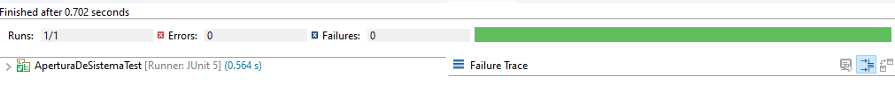
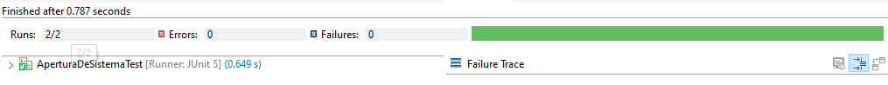
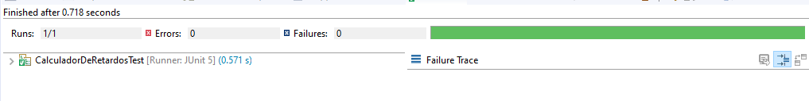
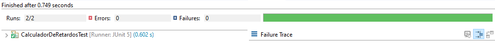

## Postwork 7: Agregando Mockito a tu proyecto

### OBJETIVO

- Realizar pruebas unitarias en el resto de las clases de la aplicación, lo cual solo puede hacerse simulando ciertos comportamientos externos como conexiones a bases de datos.
- Configurar Mockito para regresar valores predeterminados a ciertas peticiones.

#### REQUISITOS

1. JDK 8 o superior.
2. Descargar el proyecto de la carpeta de postwork de esta sesión.

#### DESARROLLO
1. Hasta este punto no hemos podido terminar de escribir las pruebas necesarias del proyecto personal, ya que las clases **AperturaDeSistema** y **CalculadorDeRetardos** dependen de elementos externos, en este caso una conexión a base de datos para funcionar de manera correcta. Al no poder realizar una prueba de este estilo será necesario simular estas funcionalidades a través del uso de un Mock. Para este caso usaremos Mickito para simular el funcionamiento. 

Abre el archivo **pom.xml** del proyecto y agrega la siguiente dependencia:

```xml
 <dependency>
      <groupId>org.mockito</groupId>
      <artifactId>mockito-core</artifactId>
      <version>3.1.0</version>
      <scope>test</scope>
</dependency>
```
La dependencia anterior permitirá el uso de Mockito en el proyecto.

2. En el directorio de pruebas de la aplicación (*src/test/java*) crea una nueva clase llamada **AperturaDeSistemaTest** la cual usaremos para probar el funcionamiento de la clase **AperturaDeSistema**.

```java
public class AperturaDeSistemaTest {
	
}  
```

Recuerda que **AperturaDeSistema** hace uso de una instancia de *HorarioEntradaDAO*, que en este caso es una interfaz. Por lo que tendremos que hacer uso de Mockito para crear un mock o doble de esta interface para poder realizar nuestras pruebas.

3. Crea un mock de **HorarioEntradaDAO** y **HorarioEntrada** y luego inyecta ese mock en una instancia de **AperturaDeSistema**, de la siguiente forma:

```java

	@Mock
	private HorarioEntradaDAO horariosEntradasDAOmock;
	private HorarioEntrada horariosEntradasmock;

	@InjectMocks
	private AperturaDeSistema aperturaDeSistema;

	@BeforeEach
	void configurar() {
		MockitoAnnotations.initMocks(this);
	}
}
```

4. Implementa una prueba para la apertura fallida, de la sigueinte forma:

```java
	@Test
	public void pruebaAperturaFallida() {
		try {
			Mockito.when(horariosEntradasDAOmock.getUltimaFecha()).thenReturn(horariosEntradasmock);
			Mockito.when(horariosEntradasmock.getFechaInicio()).thenReturn(new Date(2011, 05, 28, 02, 44));

			assertEquals(false, aperturaDeSistema.estaDisponible(new Date(2011, 05, 28, 02, 40)));
		} catch (SQLException e) {
			fail(e);
		}
	}
```
Obseva que estamos configurando valores de retorno para métodos en los mocks **horariosEntradasDAOmock** y **horariosEntradasmock**, además de que estamos manejando la **SQLException** que se puede lanzar, y en este caso si ocurre una excepción lo que haremos es hacer que la prueba falle, ya que en realidad no estamos esperando que esto ocurra.

5. Ejecuta la prueba, la cual debe pasar de manera correcta:

 
 
6. Crea una prueba para validar la apertura correcta o exitosa del sistema, en este caso la prueba será muy parecida a la anterior, con la diferencia es que esperamos un valor de retorno diferente.

```java
	@Test
	public void pruebaAperturaExistosa() {
		try {
			Mockito.when(horariosEntradasDAOmock.getUltimaFecha()).thenReturn(horariosEntradasmock);
			Mockito.when(horariosEntradasmock.getFechaInicio()).thenReturn(new Date(2011, 05, 28, 14, 44));

			assertEquals(true, aperturaDeSistema.estaDisponible(new Date(2011, 05, 28, 14, 50)));
		} catch (SQLException e) {
			fail(e);
		}
	}
```

Com puedes ver, esta prueba es muy parecida a la anterior, con la diferencia de que esperamos un valor distinto en la validación del final.

7. Ejecuta nuevamente la prueba, y esta debe volver a pasar de forma correcta:



8. Implementa las pruebas de la clase **CalculadorDeRetardos** creando una nueva clase de pruebas llamada **CalculadorDeRetardosTest**. Como **CalculadorDeRetardos** depende de **HorarioEntradaDAO** crearemos un mock de esta clase e inicializaremos el resto de los elementos:

```java
public class CalculadorDeRetardosTest {
	@Mock
    private HorarioEntradaDAO horariosEntradasDAOmock;
	
	@Mock
    private HorarioEntrada horariosEntradasmock;
	
	@InjectMocks
    private CalculadorDeRetardos calculadorDeRetardos;
	
	@BeforeEach
	void configurar() {
		MockitoAnnotations.initMocks(this);
	}
}

```
9. Ahora, crea un método que prueba si se tiene un retardo de 10 minutos, para esto haremos usdo de los mocks que declaramos hace un momento:

```java
	@Test
	public void pruebaRetardoDiezMinutos() {
		try {
			Mockito.when(horariosEntradasDAOmock.getUltimaFecha()).thenReturn(horariosEntradasmock);
			Mockito.when(horariosEntradasmock.getFechaInicio()).thenReturn(new Date(2011, 05, 25, 12, 0));

			assertEquals(10, calculadorDeRetardos.getRetardo(new Date(2011, 05, 25, 12, 10)));
		} catch (SQLException e) {
			fail(e);
		}
	}
```

10. Ejecuta la prueba, la cual debe pasar de forma correcta:



11. Para terminar, agregaremos una prueba que valide si se llega a tiempo:

```java
	@Test
	public void pruebaRetardoLlegandoATiempo() {
		try {
			Mockito.when(horariosEntradasDAOmock.getUltimaFecha()).thenReturn(horariosEntradasmock);
			Mockito.when(horariosEntradasmock.getFechaInicio()).thenReturn(new Date(2011, 05, 25, 12, 0));

			assertEquals(0, calculadorDeRetardos.getRetardo(new Date(2011, 05, 25, 12, 0)));
		} catch (SQLException e) {
			fail(e);
		}
	}
```

12. Ejecuta nuevamente la prueba la cual debe pasar de forma correcta:


