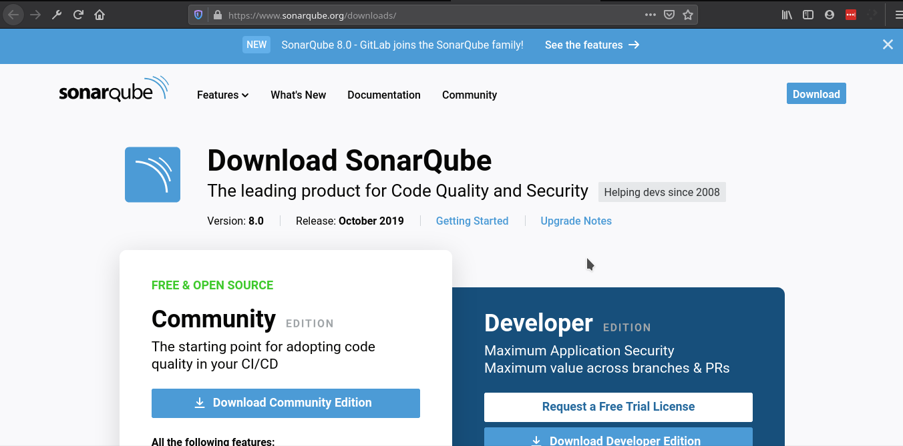

## SonarQube: Ejercicio 1


#### Descarga del servidor

1. Ingresar a la página [https://www.sonarqube.org/downloads/](https://www.sonarqube.org/downloads/) y descargar la versión _Comunity_.
    
1. Descomprimir el archivo ZIP en alguna ruta de nuestro equipo. (Esta ruta será llamada servidor_base)
1. Entrar a servidor_base\bin\windows-x86-6\ (estas instrucciones son específicas para windows. Existen carpetas para MacOS y para Linux).
1. Ejecutar, con permisos de administrador InstallNTService.bat
1. Ejecutar, con permisos de administrador StartNTService.bat
1. Ejecutar, con permisos de adminsitrador StartSonar.bat
    

Con esto debemos poder ingresar a [http://localhost:9000](http://localhost:9000) y ver la interfaz web de SonarQube.

   

De forma predeterminada exite el usuario _admin_ con contraseña _admin_.

_Nota:_  En la parte de abajo aparecerá una advertencia referente a la base de datos. Como no se ha configurado ninguna, SonarQube se inicia con una base de datos en memoria. Esta es volatil y debe ser utilizada sólo para pruebas. La configuración completa del servidor queda fuera del alcance de esta sesión.

#### Instalación del cliente

Usaremos sonar-scanner como cliente.

1. Ingresar a la página  [https://docs.sonarqube.org/latest/analysis/scan/sonarscanner](https://docs.sonarqube.org/latest/analysis/scan/sonarscanner) y descargar el cliente según el sistema operativo (estas instrucciones son específicas para windows, pero son semejantes en MacOS y Linux).
    
1. Descomprimir el archivo ZIP en alguna ruta de nuestro equipo. (Esta ruta será llamada cliente_base).

#### Ejecutar un análisis

1. Usando Git, clonar el proyecto del [ejercicio](./).
1. Antes de iniciar el análisis deberás compilar el proyecto, esto se desde la línea de comandos, ubicado en la carpeta raíz del proyecto
```bash
   mvn package
```

1. Para iniciar el análisis ejecuta:
```bash
    cliente_base\bin\sonar-scanner
```
#### Revisión de resultados

Si regresamos a [http://localhost:9000](http://localhost:9000) podremos ver el resultado del análisis (o un mensaje de que aún está en ejecución).

  

Navega por los resultados del análisis y familiarízate con la interfaz de SonarQube.
