## Ejemplo 02: Modificación de Quality Profile

### Desarrollo 

1. Entra a SonarQube como administrador. (Usa _admin_ para usuario y contraseña)
   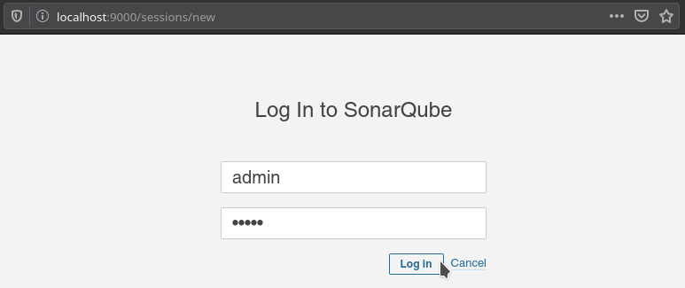
1. Entra a Quality Profiles
   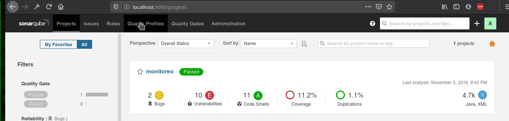
1. Busca la sección de Java y copia el perfil _Sonar way_. Nombralo _bedu_
   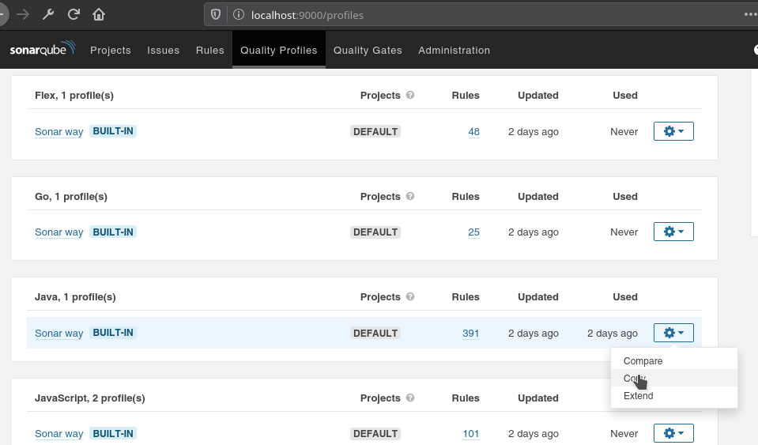
1. Esto te llevará a la pantalla de administración del nuevo perfil. En la izquierda hay un panel con las reglas, da click sobre el 36 correspondiente a _Vulnerabilities_
   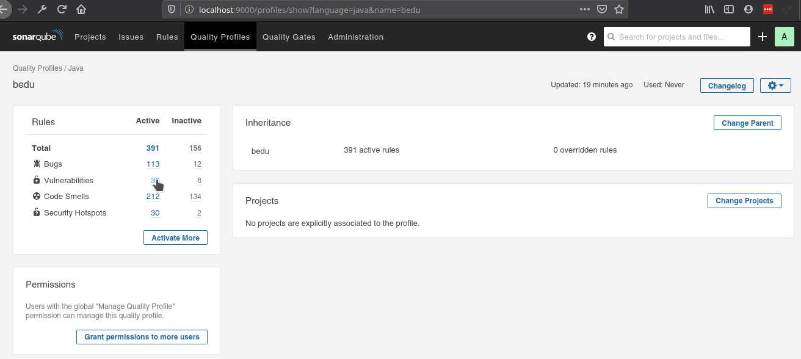
1. Busca la regla _Persistent entities should not be used as arguments of "@RequestMapping" mehotds_ y desactívala **Desactivar reglas no es algo que se deba hacer a la ligera. Esto se hace con fines méramente educativos**
   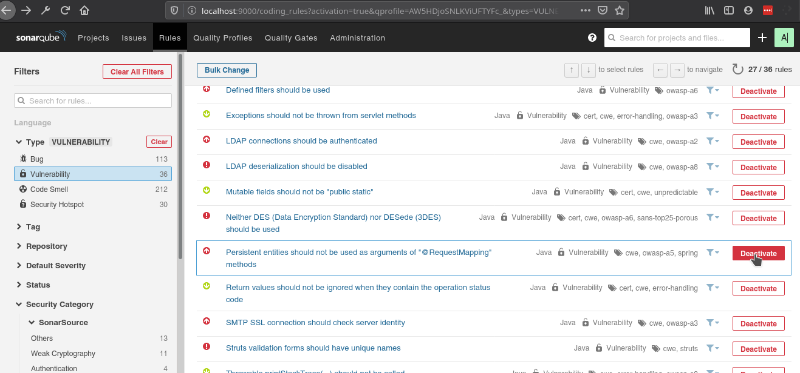
1. Vuelve a entrar a la sección _Quality Profiles_ y establece el perfil _bedu_ como el default.
   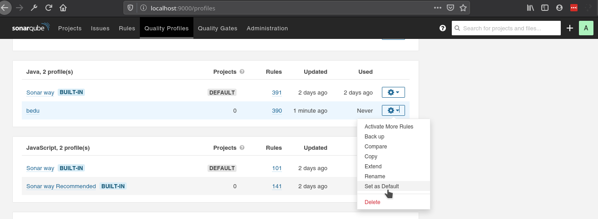
1. Ejecuta una vez más el análisis de sonarqube como lo hiciste en el Ejercicio 1 
  ```bash
  sonar-scanner
  ```
##### Resultado original
  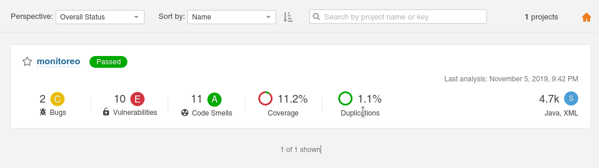

##### Nuevo resultado
  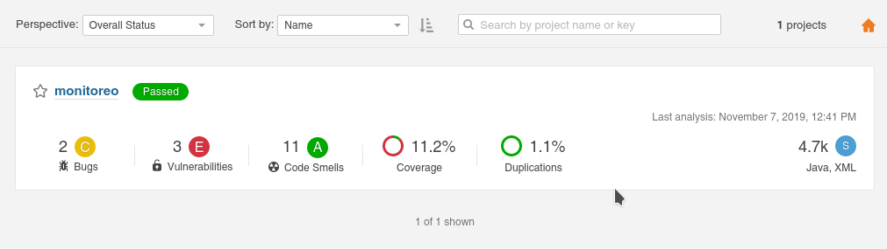

  Como puedes ver en las dos imágenes anteriores hay una disminución en el número de vulnerabilidades por la modificación que hicimos al perfil.


### Modificación de Quality Gate

1. Entra a Quality Gates
   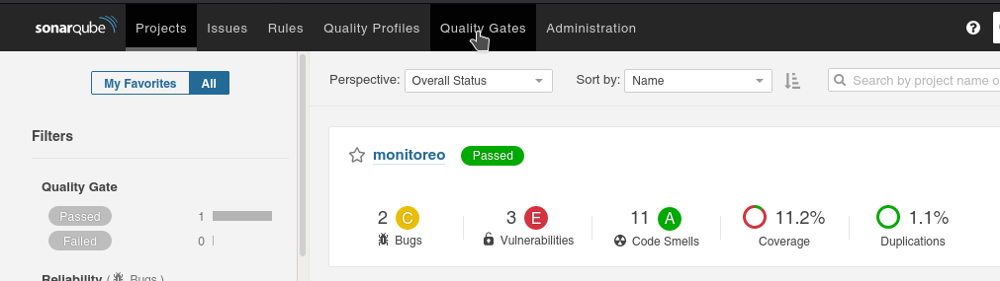
1. Copia el perfil de _Sonar way_ y llámalo _bedu QG_
   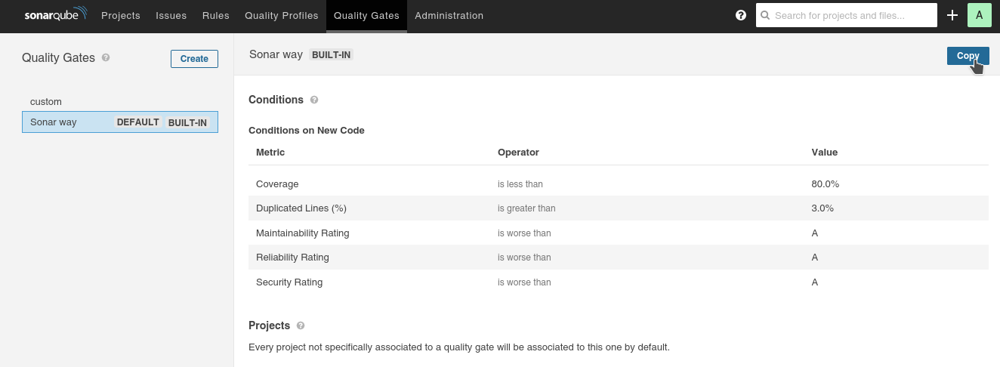
1. Agrega una nueva condición con los siguientes valores: Overall Code, Skipped Unit Test is greater than 0
   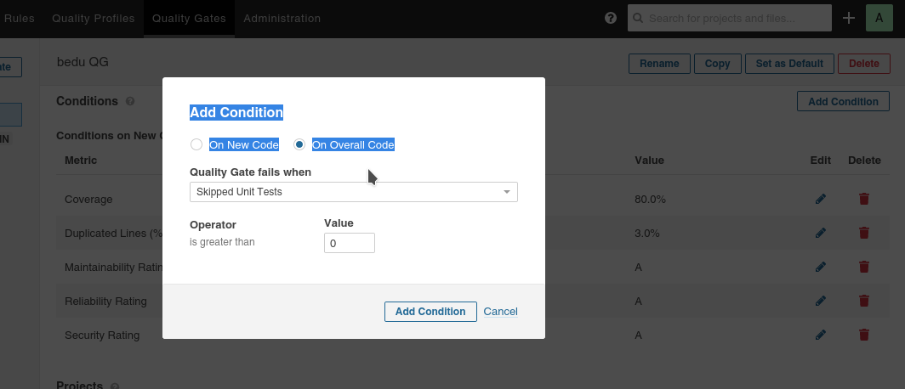
1. En la parte inferior (_Projects_) selecciona _Without_ para ver los proyectos que no usan ese perfil y selecciona el proyecto de la unidad.
   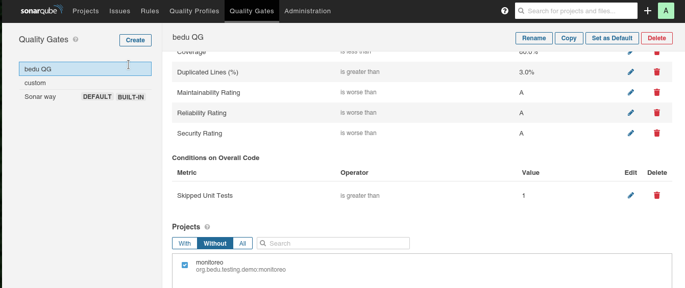
1. Ejecuta una vez más el análisis de sonarqube como lo hiciste en el Ejercicio 1
   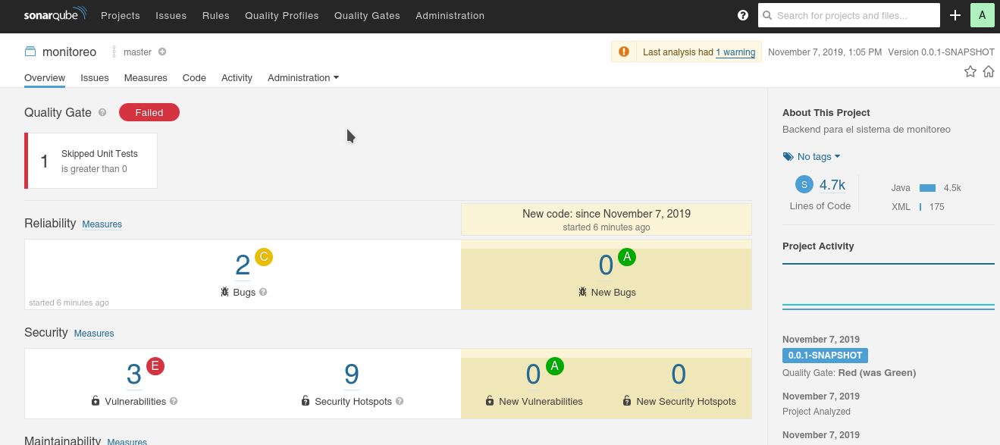

Esta vez la comprobación de calidad ha fallado ya que existe una prueba que está deshabilitada.

