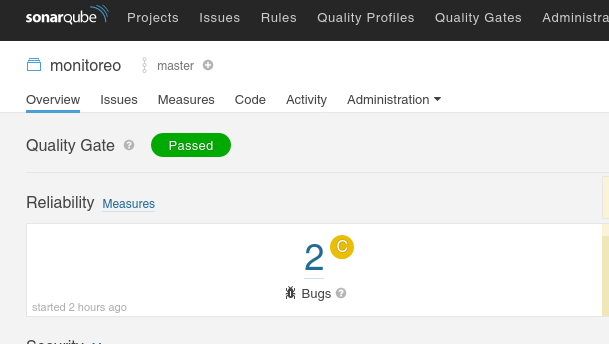
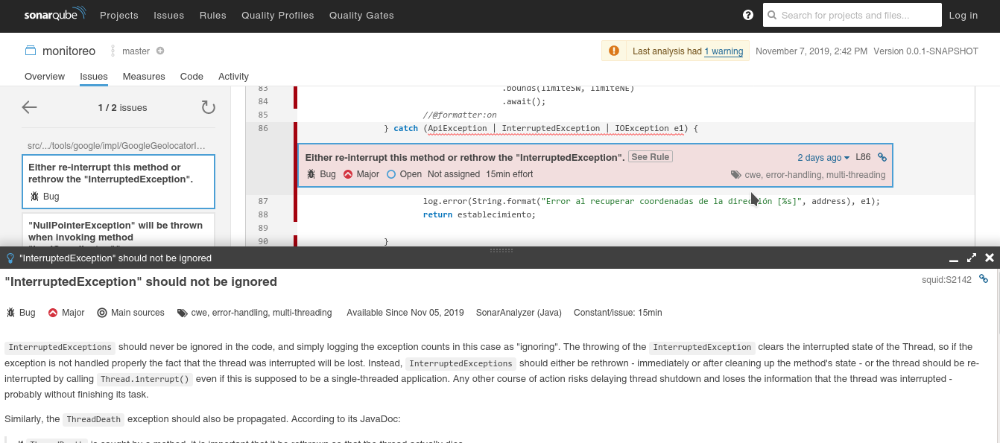
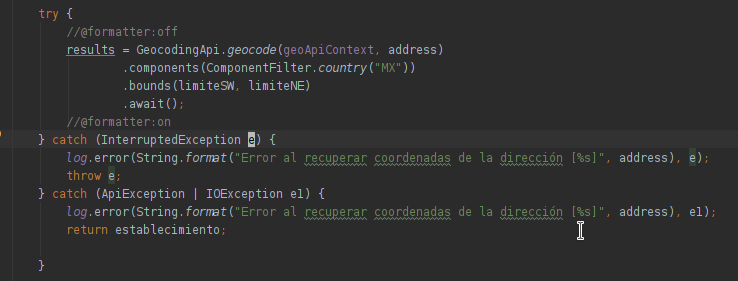
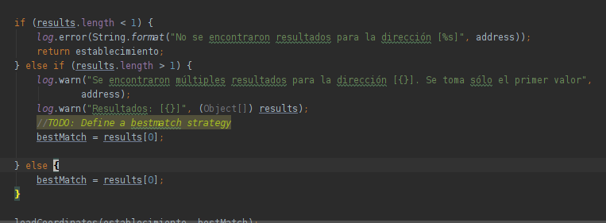
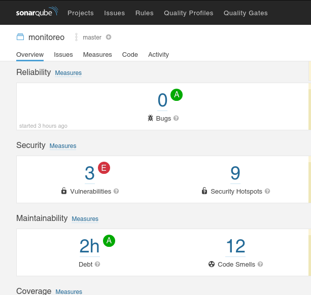

## Ejemplo 03: Corrección de errores

Al finalizar el ejercicio anterior nuestro proyecto contaba con varios problemas que afectan su calidad.

Corrige los dos bugs del código.

1. Desde la pantalla del reporte de SonarQube ingresa al panel de Bugs.

  

1. Identifica el archivo e interpreta los errores detectados (de ser necesario, da click en _See Rule_ para aclarar).

  

1. El primer bug nos indica que estamos atrapando una excepción que debe ser relanzada. Ve al archivo y separa InterruptedException de las otras dos. Dale su propio bloque catch.

  

  Hacer esto requerirá cambios en las firmas de los métodos -ya que InterruptedException es una excepción checada-, tanto de la clase como de la interfaz.

1. El segundo bug se debe a que el bloque _else if_ no asigna la variable bestMatch. Para los fines de este ejercicio usemos el mismo resultado que el bloque _else_ 

  

1. Guarda el archivo y ejecuta las pruebas para verificar que todas sigan verdes.

1. Vuelve a ejecutar el análisis de SoanrQube. 

  
