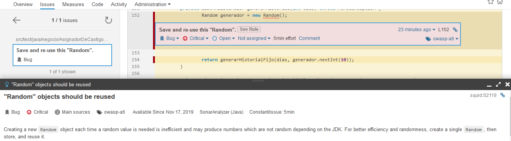

## Postwork Sesión 8: SonarQube en tu proyecto

### OBJETIVO

- Ejecutar un análisis estático de código usando SonarQube para determinar la calidad del código fuente de la aplicación.
- Verificar a deuda técnica del proyecto.
- Realizar las correcciones necesarias para lograr que el proyecto tenga una calidad aceptable.
- Reducir lo más posible la deuda técnica del proyecto.
- Aprender algunos errores comunes y la forma en la que se pueden evitar.

#### REQUISITOS

1. JDK 11.
2. SonarQube instalado y configurado.
3. Sonar Scanner instalado y configurado.

#### DESARROLLO

1. Descarga el código del proyecto desde el repositorio de la sesión, este código debe estar en el estado en el que se dejó al final de la sesión anterior.

2. Levanta SonarQube de forma que puedas tener acceso a él a través de la URL http://localhost:9000. Dependiendo de cómo lo hayas instalado puede ser posible que ya se esté ejecutando.

3. Ejecuta un análisis con SonarQube usando la siguiente instrucción.

*Nota:* Debes estar posicionado en el directorio raíz del proyecto Maven (el directorio en el que se encuentra el archivo **pom.xml**) para que el análisis se ejecute de forma correcta.

        sonar-scanner -Dsonar.projectKey=bedu-postwork -Dsonar.host.url=http://localhost:9000 -Dsonar.login=a4f5af591d64d7f02ab7b19f10c2ba7bb08b1545 -Dsonar.java.binaries=target\classes

Una vez que el análisis termine debes ver un resultado similar al siguiente en el dashboard del proyecto en SonarQube:


4. Revisa los problemas y vulnerabilidades reportados y corrígelos hasta obtener un "Quality Gate" con valor de "passed". Revisaremos algunos de los problemas más importantes y sus soluciones.

Primero, mejoraremos el tema de la confiabilidad del código. SonarQube indica que en la línea 151 del archivo **AsignadorDeCastigosTest.java** no deberíamos usar una nueva instancia de **Random** sino que debemos crear una sola instancia y reutilizar esta instancia cada vez. 



Por lo que volveremos esta una variable de clase y la inicializaremos a este nivel. 

```java
public class AsignadorDeCastigosTest {
	private AsignadorDeCastigos adc;
	private Random generador = new Random();
        ...
}
```

5. Vuelve a compilar la aplicación y a ejecutar nuevamente el análisis debes obtener un resultado diferente (una mejora) pero que aún no nos permite obtener un umbral de calidad aceptable.


6. El siguiente problema indica que el **Random** que acabamos de mover en el archivo **AsignadorDeCastigosTest** puede no ser seguro y nos sugiere cambiarlo por un **SecureRandom**.

7. El siguiente problema indica que tenemos un campo llamado **sugerencia** en la clase **Sugerencia** lo cual puede ser confuso:


por lo que renombraremos este campo a "comentario".

En la clase **AsignadorDeCastigos** eliminar la declaración que indica que se lanza una **NumberFormatException** en el método **leerPropiedades**

En la clase **AsignadorDeCastigos** modificar el método **ordenarCastigosPorPrecio** para usar lambdas en vez de inner classes. El código original es:

```java
	private void ordenarCastigosPorPrecio() {
		Collections.sort(listaCastigos, new Comparator<Castigo>() {
			public int compare(Castigo o1, Castigo o2) {
				return (int) ((o2.getPrecio() - o1.getPrecio()) * 100);
			}
		});

	}
```

que puede modificarse de la siguiente forma:

```java
	private void ordenarCastigosPorPrecio() {
		listaCastigos.sort((Castigo o1, Castigo o2) -> (int) ((o2.getPrecio() - o1.getPrecio()) * 100));
	}
```

Lo mismo en el caso del método **ordenarCastigosPorPrioridad**, el código final queda de la siguiente forma:

```java
	private void ordenarCastigosPorPrioridad() {
		listaCastigos.sort((Castigo o1, Castigo o2) ->  o2.getPrioridad() - o1.getPrioridad());
	}
```

En el método **calcularAcumulado** se puede reemplazar la instanciación del *Arraylist* **historial** usando el operador diamente, de la siguiente forma:

```java
List<Asistencia> historial = new ArrayList<>(u.getHistorial());
```

lo mismo para el método **ponerCastigos**.

8. Realizar el resto de las correcciones para que e pueda obtener un quality gate de "passed". Para esto será necesario lograr una cobertura de al menos el 80% en las clases de prueba, excluir de esto las clases del modelo y exepciones (en la configuraciónd el proyecto en Sonar).


El código corregido se encuentra el repositorio en el directorio **proyecto_corregido**.
