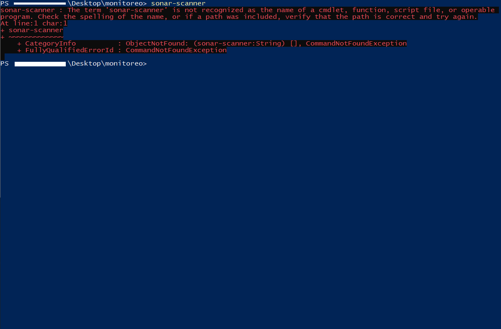
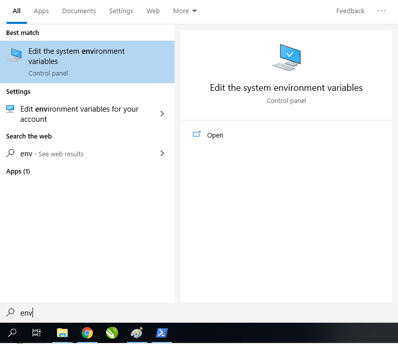
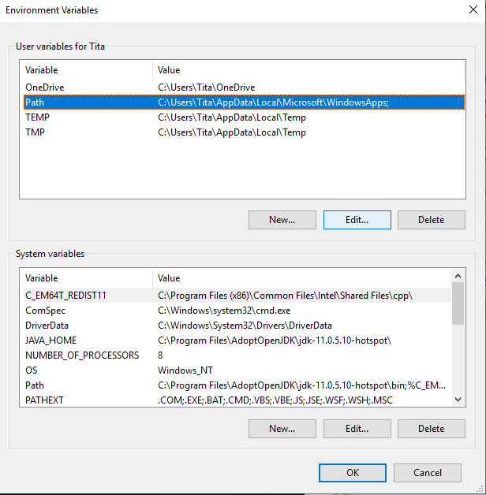
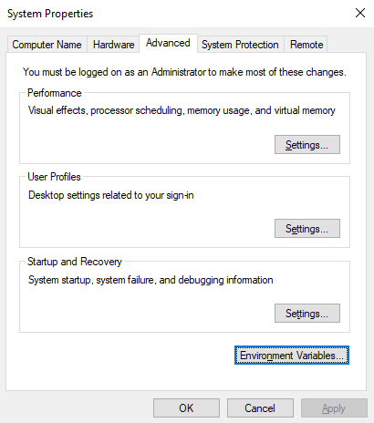
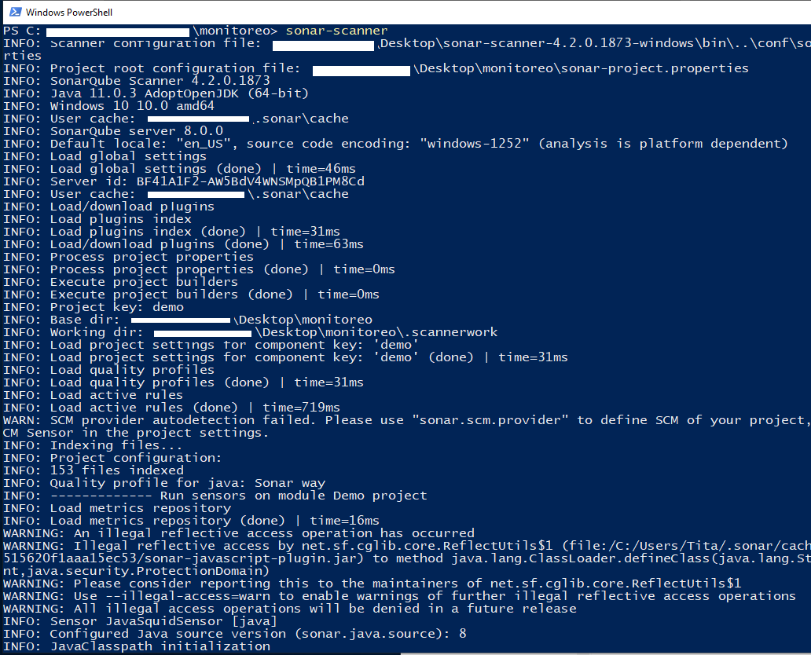

## Reto 01: Agregar sonar-scanner al PATH

### Objetivo
* Modificar nuestro sistema para tener disponible sonar-scanner sin tener que usar la ruta completa

### Requisitos

1. Haber terminado el Ejercicio-01.
1. Tener privilegios de adminsitrador en el equipo.

### Desarrollo

En el Ejercicio-01 debimos usar la ruta absoluta al archivo sonar-scanner.bat para iniciar el análisis del proyecto.

Si intentamos ejecutarlo de manera directa obtendremos un error.

  

Para evitar esto, debemos agregar la ruta _cliente_base\bin\_ al PATH de nuestro sistema operativo.

  
Solución

  <em>Estas instrucciones son específicas para Windows 10, en otras versiones puede cambiar la forma de llegar a la configuración del PATH</em>

  <ol>
      <li>Abre el menú de inicio y escribe <em>env</em></li>
         
      <li>En la ventana de Propiedades del Sistema, abre las variables de entorno</li>
         
      <li>Selecciona el Path del usuario y editalo<em>(puedes hacerlo también en el Path del sistema, pero se recomienda hacerlo sólo en el propio)</em></li>
         
      <li>Agrega la ruta equivalente a <em>cliente_base\bin</em></li>
         
  </ol>

  <strong>La variable de entorno USERPROFILE almacena la ruta hasta el usuario de la sesión.</strong>

  Para verificar si lo hicíste corréctamente, inicia nuevamente el análisis, pero esta vez sólo con el siguiente comando

 <code>
     sonar-scanner
  </code>

Ten en cuenta que deberás abrir una nueva línea de comandos para que se cargue el nuevo PATH.

Si la línea de comandos te da un error diciendo que sonar-scanner no es un comando, es necesraio revisar los pasos anteriores.

