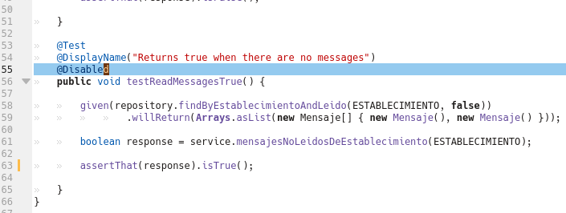

## Reto 02: Pasar la evaluación de calidad

### Objetivo
* Corregir nuestro código para satisfacer el estandar de calidad del perfil _bedu QG_ 

### Requisitos

1. Haber terminado el Ejemplo 02

### Desarrollo

Al terminar el Ejercicio-02 observamos que el código del proyecto no cubre el nuevo estandar de calidad, ya que hay una prueba deshabilitada. 

Usa el reporte de SonarQube para identificar el archivo y modifícalo para que pase el estandar de calidad.

  
Solución

  <ol>
      <li>Abre el reporte de SonarQube y da click sobre el panel del error</li>
         
      <li>Identifica el archivo que tiene la prueba comentada</li>
         
      <li>Abre el archivo y corrige el problema eliminando la anotación <em>@Disabled</em></li>
         
      <li>Ejecuta las pruebas para verificar que todas estén en verde</li>
      <li>Vuelve a ejecutar el análisis de SonarQube</li>
  </ol>

  <strong>SonarQube no ejecuta las pruebas, sólo recibe el dato del agente, debes tener cuidado de ejecutar las pruebas antes de iniciar el análisis.</strong>

  

    Verifica que el código haya pasado la prueba de calidad.
  

