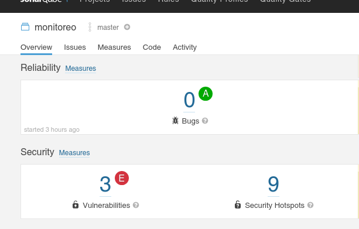
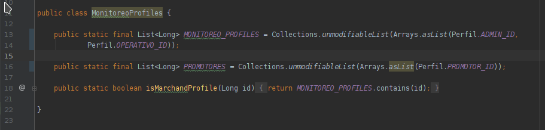
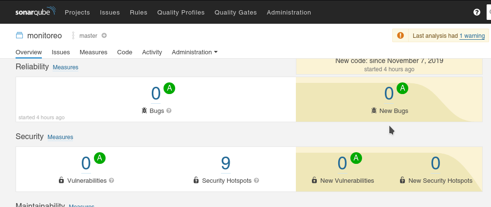

## Reto 03: Corrección de vulnerabilidades

### Objetivo
* Corregir nuestro código para eliminar las vulnerabilidades detectadas. 

### Requisitos

1. Haber terminado el Ejemplo-03.

### Desarrollo

Al terminar el Ejercicio-03 logramos eliminar un par de bugs en código, pero aún existen tres vulnerabilidades que deben ser atendidas.

Usa el reporte de SonarQube para identificar los archivos y modificarlos para eliminarlos.

  
Solución

  <ol>
      <li>Abre el reporte de SonarQube y da click sobre el panel del vulnerabilidades</li>
         
      <li>Existen dos archivos reportados. El primero detectó la palabra <em>password</em> en el archivo OAuth2AuthorizationConfig, este es un falso positivo ya que es parte de la configuración. Marcaremos el issue como falso positivo</li>
         
      <li>El otro archivo es MonitoreoProfiles, en este caso dos campos marcados como públicos nos recomienda declararlos como protegidos por ser mutables. Sin embargo esto rompería la funcionalidad del código. La solución correcta es cambiar los objetos de List a UnmodifiableList </li>
         
      <li>Ejecuta las pruebas para verificar que todas estén en verde</li>
      <li>Vuelve a ejecutar el análisis de SonarQube</li>
  </ol>

  

    Esta vez el reporte no tiene bugs ni vulnerabilidades, por lo que hemos mejorado la calidad de nuestro código.

         
  

